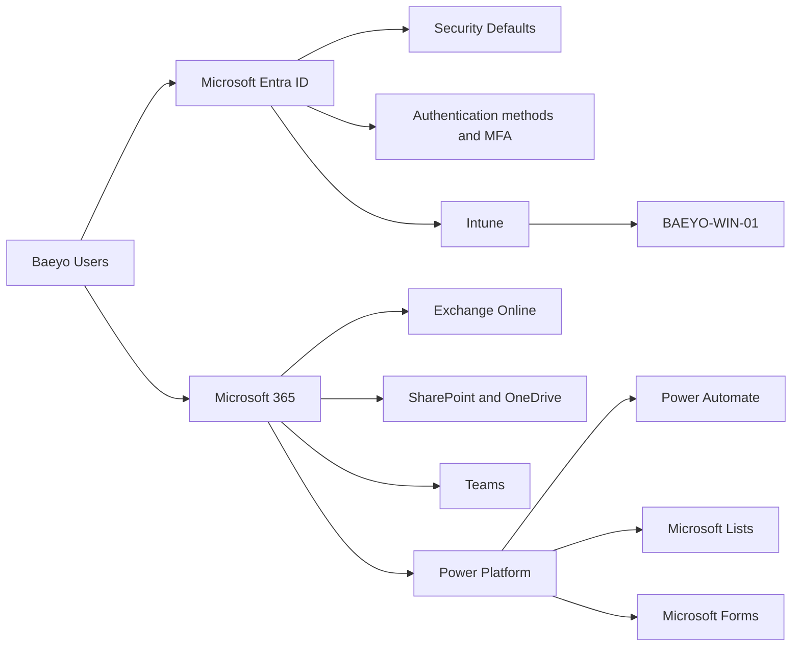

# Baeyo Digital — Microsoft 365 Administration Lab (Public Portfolio)

> A completed enterprise-style deployment and operations case study built around a real small-business scenario.

## Purpose

This repository is the sanitized public portfolio record for the Baeyo Digital Microsoft 365 administration lab. The authoritative private master is maintained separately and remains unchanged. It documents the design, configuration, testing, retrospective validation, operational automation, security hardening, and handover completed across Modules 00–08.

The project demonstrates practical experience with:

- Microsoft 365 administration
- Microsoft Entra ID identity and access management
- Microsoft Intune and Windows endpoint management
- Exchange Online, SharePoint, Teams, and OneDrive
- Power Platform governance and automation
- Security hardening, monitoring, and operational handover

## Environment

| Item | Value |
|---|---|
| Organization | Baeyo Digital |
| Primary workstation | `BAEYO-WIN-01` |
| Tenant type | Microsoft 365 cloud-only tenant |
| Subscription at lab closure | Microsoft 365 Business Premium |
| Tenant-wide access model | Security Defaults; no Conditional Access policies |
| Primary daily user | `valery` |
| Dedicated admin | `tenant-admin` |
| Test user | `lab-user` |
| Documentation format | Markdown + sanitized screenshots + Mermaid |
| Repository visibility | Sanitized public portfolio; authoritative private master maintained separately |

## Deployment modules

0. [Workstation and documentation](docs/00-workstation-documentation.md)
1. [Identity, groups, and licensing](docs/01-identity-groups-licensing.md)
2. [Authentication and Entra security](docs/02-authentication-security.md)
3. [Windows, Entra join, and Intune](docs/03-windows-intune.md)
4. [Microsoft 365 apps and workstation](docs/04-m365-apps-workstation.md)
5. [Exchange, SharePoint, Teams, and OneDrive](docs/05-exchange-sharepoint-teams.md)
6. [Power Platform governance](docs/06-power-platform-governance.md)
7. [Service operations, intake, and workflow automation](docs/07-service-operations-intake-and-workflow-automation.md)
8. [Hardening, monitoring, and handover](docs/08-hardening-monitoring-and-handover.md)

## Architecture overview

## Evidence rules

- Never commit passwords, recovery codes, access tokens, tenant secrets, full license keys, customer data, or private personal information.
- Use anonymized sign-in identifiers while retaining public display names and role separation where they support the case study.
- Tenant IDs, object IDs, serial numbers and other unique values are redacted where unnecessary.
- Crop screenshots to the relevant configuration area.
- Distinguish original implementation, historical troubleshooting, retrospective validation, and current-state evidence.
- Include the date, objective, configuration, reason, test, and result in every module.
- Use descriptive evidence file names.
- Keep raw source captures outside the repository. Publish only separately reviewed and sanitized copies.

## Status

Modules 00–08 are complete. The dates below are documentation completion or merge dates; individual modules retain their original implementation and retrospective-validation timelines.

| Module | Status | Completed |
|---|---|---|
| 00 — Workstation and documentation | Completed | 2026-08-17 |
| 01 — Identity, groups, licensing | Completed | 2026-08-19 |
| 02 — Authentication and security | Completed | 2026-08-20 |
| 03 — Windows and Intune | Completed | 2026-08-24 |
| 04 — M365 apps | Completed | 2026-08-24 |
| 05 — Collaboration services | Completed | 2026-08-25 |
| 06 — Power Platform governance | Completed | 2026-08-26 |
| 07 — Service operations and automation | Completed | 2026-08-30 |
| 08 — Hardening, monitoring, and handover | Completed | 2026-09-01 |
