# Module 00 — Windows Administration Workstation and Documentation Baseline

## Document status

| Field | Entry |
|---|---|
| Documentation type | Sanitized public portfolio copy |
| Documentation status | Approved for repository inclusion on 2026-08-17 |
| Implementation period | 2026-07-20 to 2026-07-24 |
| Retrospective validation | 2026-08-13 to 2026-08-14 |
| Implemented by | Valery |
| Device | `BAEYO-WIN-01` |
| Change reference | `CHG-0001` |
| Overall result | Implemented with documented follow-up actions |

> **Retrospective documentation notice:** The workstation was configured before a complete evidence process was in place. Original screenshots were retained where available. Missing evidence was captured retrospectively from the current system state. Current-state validation is not presented as original before-state evidence.

## Objective

Prepare a controlled Windows workstation for Microsoft 365 administration, establish a local working structure and private GitHub repository, install the required command-line and Microsoft administration tooling, and create a repeatable evidence process for the remaining Baeyo Digital deployment modules.

## Business reason

Baeyo Digital required a consistent administration workstation for tenant configuration, troubleshooting, scripting, documentation and portfolio evidence. Separating the workstation baseline from later tenant work makes configuration changes easier to validate and reduces the risk of undocumented changes.

## Scope

### Included

- Record the initial Windows workstation state.
- Confirm Windows edition, device specifications and security health.
- Rename the workstation to `BAEYO-WIN-01`.
- Review storage partitioning and memory capacity.
- Validate Windows PowerShell 5.1 and PowerShell 7.
- Install and validate Git and the Microsoft administration modules.
- Establish `C:\BAEYO` and the local repository structure.
- Create and validate the private GitHub repository.
- Capture, name and review Module 00 evidence.

### Excluded or deferred

- Microsoft Entra join and Intune enrolment, covered in later modules.
- Enabling BitLocker, deferred until administrator access and recovery-key handling are confirmed.
- Installing the missing `Az` module, deferred because it is not required for the immediate Microsoft 365 work.
- Reinstalling GitHub Desktop, not required because Git and GitHub CLI provide the current workflow.
- Recovering or resetting the original local administrator credential, tracked as a separate follow-up.

## Initial state

The Dell OptiPlex 790 was running Windows 11 Pro under a local administrator account named `BaeyoDigital`. The original hostname was `DESKTOP-1ESR2TM`. The device had 4 GB DDR3 RAM and approximately 233 GB of storage. It was not signed into a Microsoft account, Windows Hello was not configured, and no organisational connection was shown in the captured account state.

Windows Security reported no action required across the principal protection areas. Defender reported no current threats and current security intelligence. Device health reported no storage, application/software or Windows Time issues.

## Design decisions

| Decision | Selected approach | Reason |
|---|---|---|
| Workstation name | `BAEYO-WIN-01` | Provides a consistent, organisation-style device identity. |
| Daily working identity | `Valery-BaeyoDigital` | Keeps normal workstation use separate from the Microsoft 365 privileged administrator identity. |
| Privileged tenant identity | Separate `tenant-admin` account | Supports least privilege for Microsoft 365 administration. |
| Working root | `C:\BAEYO` | Provides a predictable location for the repository and local-only work. |
| Repository model | Separate private master and sanitized public portfolio | Preserves detailed internal records while presenting a safe public case study. |
| Shells | Windows PowerShell 5.1 and PowerShell 7 | Retains compatibility with Windows components while using the current cross-platform PowerShell for administration. |
| Evidence model | Original evidence plus labelled retrospective validation | Preserves honesty where screenshots were not captured during implementation. |
| Git trust exception | Repository-specific `safe.directory` entry | Resolves the verified ownership change without trusting all repositories globally. |
| BitLocker | Record current state; do not enable during evidence capture | Encryption requires a planned change, administrator access and safe recovery-key storage. |

## Implementation record

### 1. Record the original workstation state

The initial system, account, hardware and security state was captured before the later Entra-connected working profile became the normal session. Device and Product IDs were redacted from the retained evidence.

### 2. Rename the workstation

The hostname was changed from `DESKTOP-1ESR2TM` to `BAEYO-WIN-01`. The result was validated with `hostname` and `Get-ComputerInfo`.

> `Get-ComputerInfo` returned `Windows 10 Pro` as a compatibility-style product value even though Settings evidence confirms Windows 11 Pro. The screenshot is used to validate the hostname, not the Windows edition.

### 3. Review disk and memory layout

Disk Management showed a 232.88 GB disk with an operating-system volume, a secondary data volume, a system partition and a recovery partition. The captured historical layout showed `C:` at 134.30 GB and `E:` at 97.66 GB. A later BitLocker view showed the fixed data volume as `D:`; the evidence establishes the state at each capture time but does not establish when or why the drive letter changed.

PowerShell inventory reported two installed memory modules of approximately 2 GB each, four memory-device positions reported by the system, and a maximum reported capacity of approximately 32 GB. This supported the plan to increase memory later.

### 4. Validate PowerShell

Windows PowerShell 5.1 remained available with `PSEdition` set to `Desktop`.

PowerShell 7.6.3 had previously been evidenced, but retrospective validation found that `pwsh` was no longer available and the expected executable path did not exist. PowerShell 7.6.4 was installed with Windows Package Manager and validated on `BAEYO-WIN-01` with `PSEdition` set to `Core`. This was recorded as configuration drift and remediation.

Key validation commands:

```powershell
hostname
$PSVersionTable
winget list --id Microsoft.PowerShell
Test-Path 'C:\Program Files\PowerShell\7\pwsh.exe'
winget install --id Microsoft.PowerShell --source winget
```

### 5. Establish the local working structure

The working root was created at `C:\BAEYO` with:

```text
C:\BAEYO
├── baeyo-m365-admin-lab
└── local-work
```

The repository contained `assets`, `diagrams`, `docs`, `scripts`, `.gitattributes`, `.gitignore` and `README.md`.

### 6. Configure and validate Git/GitHub

Git 2.55.0 for Windows was validated. No explicit local or global command-line Git identity was returned during retrospective validation; the original commits had been created through the earlier GitHub Desktop workflow.

The repository initially produced Git's `detected dubious ownership` protection because it had been created under the original local Windows identity (`BAEYO-WIN-01\BaeyoDigital`) and was later accessed through the Entra-connected identity (`AzureAD\Valery-BaeyoDigital`). After confirming the exact repository and ownership context, a repository-specific trust exception was used:

```powershell
git config --global --add safe.directory C:/BAEYO/baeyo-m365-admin-lab
```

The following were then validated:

- Repository root: `C:/BAEYO/baeyo-m365-admin-lab`
- Branch: `main`
- Remote: `https://github.com/valeryau/baeyo-m365-admin-lab.git`
- Local state: clean and aligned with `origin/main`
- Commit history: initial commit plus starter-pack commit
- GitHub visibility: private

GitHub Desktop was used during the original starter-pack staging process but was no longer installed during retrospective validation. Git and GitHub CLI remained installed, so GitHub Desktop was not reinstalled solely for evidence.

### 7. Validate Microsoft administration modules

The following modules were available to PowerShell 7 during retrospective validation:

| Module | Version |
|---|---:|
| ExchangeOnlineManagement | 3.10.0 |
| Microsoft.Graph | 2.38.1 |
| MicrosoftTeams | 7.9.0 |
| PnP.PowerShell | 3.3.0 |

The `Az` module was included in the inventory query but did not appear in the result. It was not installed during the documentation session because it was not required for the current Microsoft 365 scope.

### 8. Validate current Windows status

Retrospective validation showed:

- Windows 11 Enterprise activated with a digital licence.
- Windows 11 Enterprise subscription active.
- Windows Update reported the device up to date after a completed check.
- BitLocker off on the operating-system, fixed-data and attached removable volumes.

The original evidence showed Windows 11 Pro. The later Enterprise state reflects a licensing/subscription change after the original workstation baseline and is not presented as the original edition.

## Troubleshooting record

### TRB-00-01 — PowerShell 7 command unavailable

| Field | Record |
|---|---|
| Symptom | `pwsh` returned `CommandNotFoundException`. |
| Context | Retrospective validation of the workstation toolset. |
| Finding | Windows PowerShell 5.1 worked, but Windows Package Manager found no PowerShell 7 package and the expected executable path returned `False`. |
| Resolution | Installed PowerShell 7.6.4 using `winget install --id Microsoft.PowerShell --source winget`. |
| Validation | `pwsh`, `hostname` and `$PSVersionTable` confirmed PowerShell 7.6.4 Core on `BAEYO-WIN-01`. |
| Lesson | Revalidate tool availability after account, OS or workstation changes instead of assuming the earlier installation persists. |

### TRB-00-02 — Git repository rejected because of ownership

| Field | Record |
|---|---|
| Symptom | Git returned `detected dubious ownership`. |
| Context | The repository had been created under the old local account and was being accessed through the Entra-connected account. |
| Root cause | The repository directory owner and current Windows security identity were different. |
| Resolution | Confirmed the `.git` directory and added only this repository to Git's global `safe.directory` list. |
| Validation | `git status`, branch and remote checks completed successfully; the working tree was clean. |
| Lesson | Use a path-specific trust exception only after verifying ownership; do not use a wildcard trust rule. |

### TRB-00-03 — Repository location and hidden metadata confusion

| Field | Record |
|---|---|
| Symptom | The visible folder appeared to contain files but Git commands initially failed, and `.git` was not visible in normal Explorer views. |
| Context | The starter pack had been copied/imported during the initial GitHub setup. |
| Resolution | Searched for the hidden `.git` directory, confirmed `C:\BAEYO\baeyo-m365-admin-lab`, and then diagnosed the ownership protection. |
| Lesson | `.git` is hidden repository metadata; its absence from a normal folder view does not prove that the directory is not a repository. |

### TRB-00-04 — Local administrator elevation unavailable during validation

| Field | Record |
|---|---|
| Symptom | The remembered local administrator credentials were not accepted by the UAC credential prompt. |
| Context | Attempted elevated BitLocker status validation. |
| Resolution during this module | Cancelled the elevation attempt and captured the read-only BitLocker Control Panel status without changing encryption. |
| Current status | Local administrator access recovery remains a separate follow-up; no password was reset during evidence collection. |
| Lesson | Maintain a tested, secured recovery method for local administrator access before it is needed. |

## Verification results

| Test ID | Test | Expected result | Actual result | Status |
|---|---|---|---|---|
| T00-01 | Confirm Windows edition and activation | Supported Windows edition is active | Windows 11 Pro initially; Windows 11 Enterprise digital licence/subscription active retrospectively | Pass |
| T00-02 | Run `hostname` | `BAEYO-WIN-01` | `BAEYO-WIN-01` | Pass |
| T00-03 | Validate Windows PowerShell | Version returned | 5.1.26100.9168, Desktop | Pass |
| T00-04 | Validate PowerShell 7 | Version returned | 7.6.4, Core | Pass after remediation |
| T00-05 | Run `git --version` | Git version returned | 2.55.0.windows.3 | Pass |
| T00-06 | Validate local structure | Working and repository paths exist | `C:\BAEYO`, repository and `local-work` confirmed | Pass |
| T00-07 | Validate repository | Correct root, branch and remote | Root, `main`, origin and clean state confirmed | Pass after remediation |
| T00-08 | Validate pushed commits | Commits visible locally and online | Two commits confirmed in Git and private GitHub | Pass |
| T00-09 | Validate administration modules | Required M365 modules available | Four M365 modules confirmed; `Az` absent | Partial / acceptable for current scope |
| T00-10 | Confirm Windows Update | Current update check completed | Up to date | Pass |
| T00-11 | Confirm BitLocker status | State documented | Off on captured volumes | Recorded / follow-up required |
| T00-12 | Confirm local administrator access | Elevation succeeds | Remembered credentials not accepted | Follow-up required |

## Definitive evidence inventory

All paths below are relative to this document's intended repository location at `docs/00-workstation-documentation.md`.

| Evidence ID | Filename | Classification | What it proves |
|---|---|---|---|
| E00-01 | `00-01-initial-system-overview.png` | Original / primary | Original hostname and local-account system overview. |
| E00-02 | `00-02-windows-security-baseline.png` | Original / primary | Initial Windows Security protection overview. |
| E00-03 | `00-03-defender-threat-protection-status.png` | Original / supporting | No current threats and current protection intelligence. |
| E00-04 | `00-04-initial-account-protection-state.png` | Original / primary | No Microsoft sign-in and Windows Hello not configured. |
| E00-05 | `00-05-device-health-report.png` | Original / supporting | Storage, software and Windows Time health. |
| E00-06 | `00-06-local-administrator-account.png` | Original / primary | Original `BAEYODIGITAL` local administrator account. |
| E00-07 | `00-07-initial-device-specifications-redacted.png` | Original / primary | Hardware, Windows 11 Pro and original hostname; identifiers redacted. |
| E00-08 | `00-08-device-rename-validation.png` | Original / primary | Successful hostname change to `BAEYO-WIN-01`. |
| E00-09 | `00-09-github-starter-pack-staged.png` | Original / primary | GitHub Desktop staging the 28-file starter pack. |
| E00-10 | `00-10-disk-partition-layout.png` | Original / primary | Historical disk and partition layout. |
| E00-11 | `00-11-powershell-memory-inventory.png` | Original / supporting | Installed memory modules and reported upgrade capacity. |
| E00-12 | `00-12-powershell-7-version-validation.png` | Retrospective / primary | Final PowerShell 7.6.4 validation. |
| E00-12A | `00-12a-powershell-7-missing-installation-resolution.png` | Retrospective / troubleshooting | Missing `pwsh`, diagnostics, installation and successful remediation. |
| E00-13 | `00-13-windows-powershell-51-validation.png` | Retrospective / primary | Windows PowerShell 5.1 validation. |
| E00-14 | `00-14-git-installation-identity-validation.png` | Retrospective / primary | Git version and blank explicit Git identity configuration. |
| E00-14A | `00-14a-git-dubious-ownership-error.png` | Retrospective / troubleshooting | Repository ownership mismatch and Git protection message. |
| E00-15 | `00-15-baeyo-local-folder-structure.png` | Retrospective / primary | `C:\BAEYO` and repository contents. |
| E00-16 | `00-16-local-repository-validation.png` | Retrospective / primary | Repository root, clean state, branch and remote. |
| E00-17 | `00-17-git-commit-history.png` | Retrospective / primary | Two commits and blank explicit local/global identity values. |
| E00-18 | `00-18-private-github-repository-validation.png` | Retrospective / primary | Private online repository, `main`, files and two commits. |
| E00-19 | `00-19-administration-modules-inventory.png` | Retrospective / primary | Installed Microsoft administration module versions. |
| E00-20 | `00-20-windows-activation-status.png` | Retrospective / primary | Windows 11 Enterprise digital activation and active subscription. |
| E00-21 | `00-21-windows-update-status.png` | Retrospective / primary | Completed update check and up-to-date status. |
| E00-22 | `00-22-bitlocker-encryption-status.png` | Retrospective / primary | BitLocker off on the displayed volumes. |

## Evidence links

### Initial workstation state

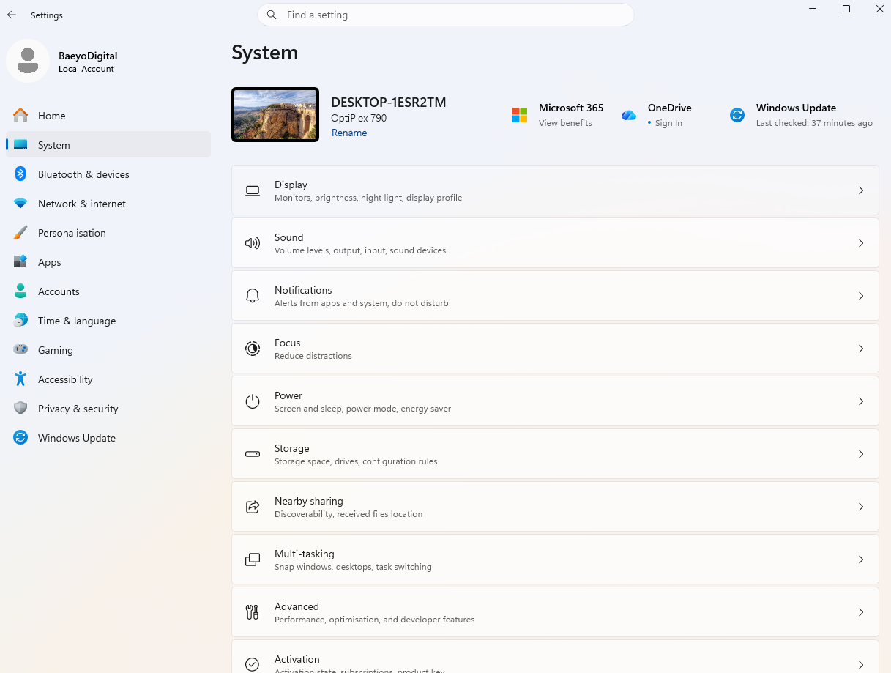

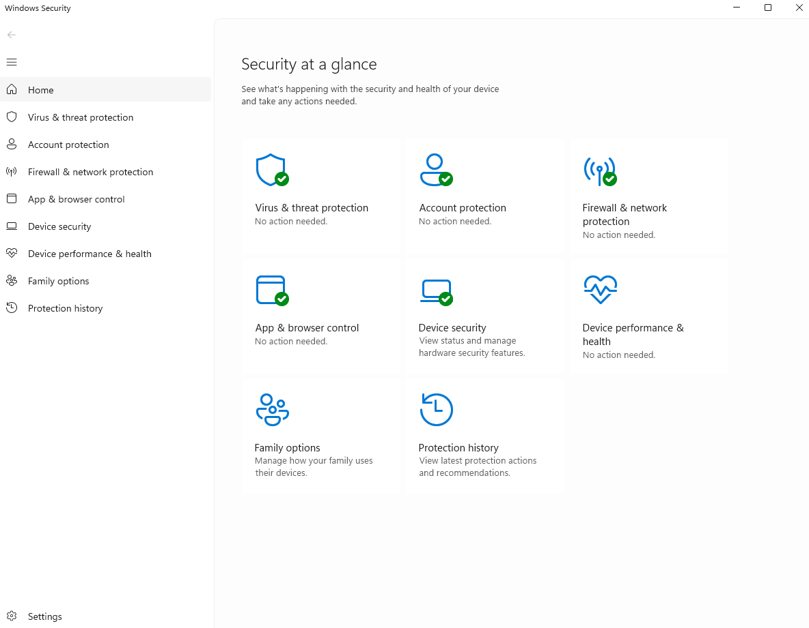

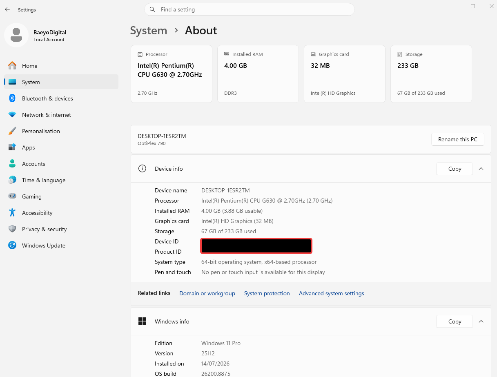

### Workstation implementation

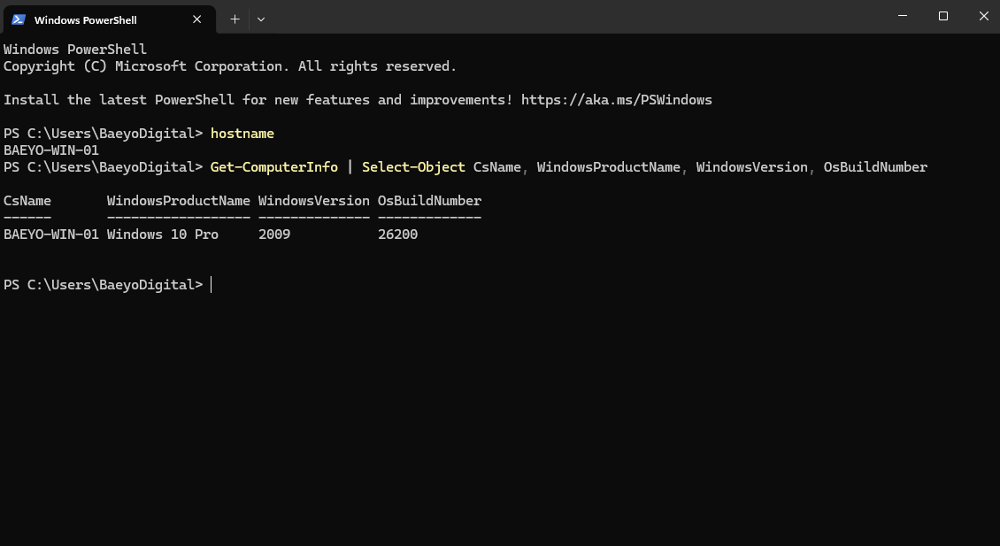

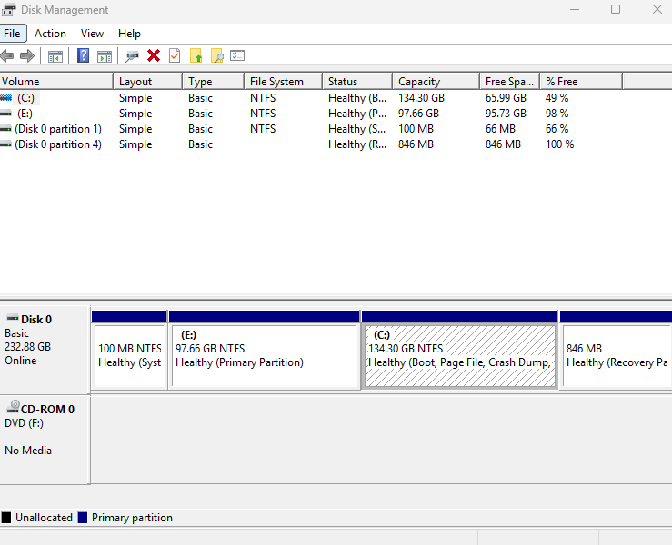

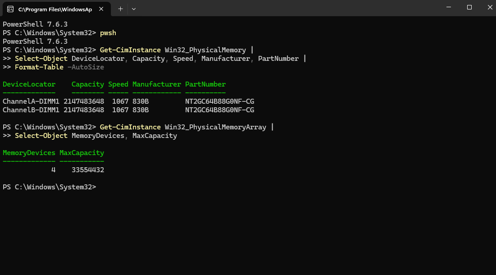

### Tooling and repository validation

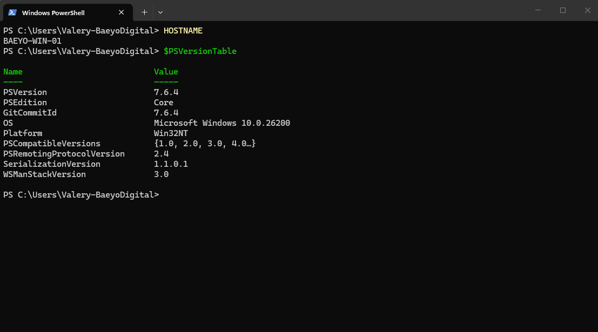

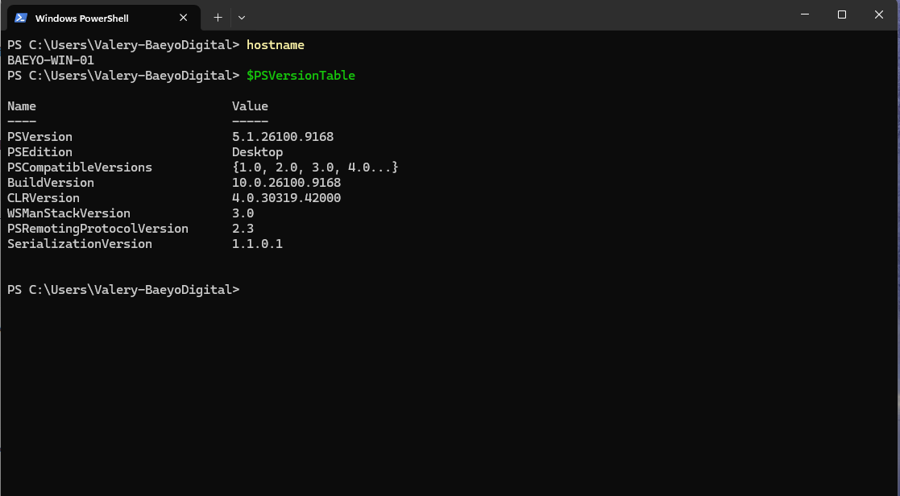

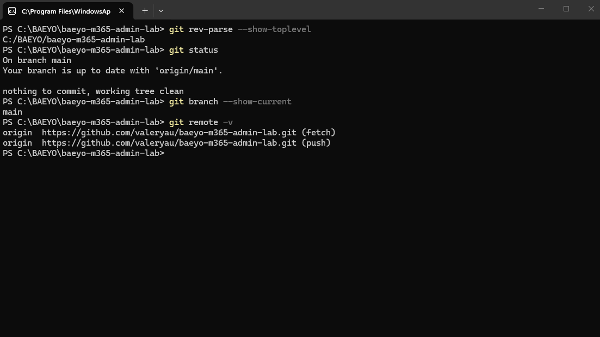

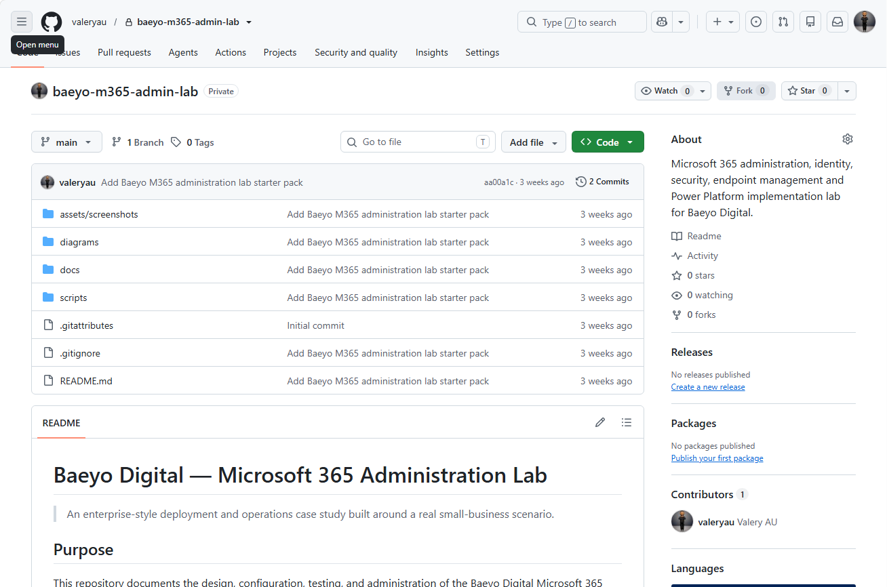

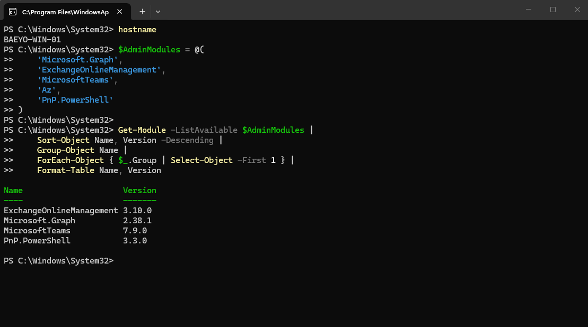

### Current Windows posture

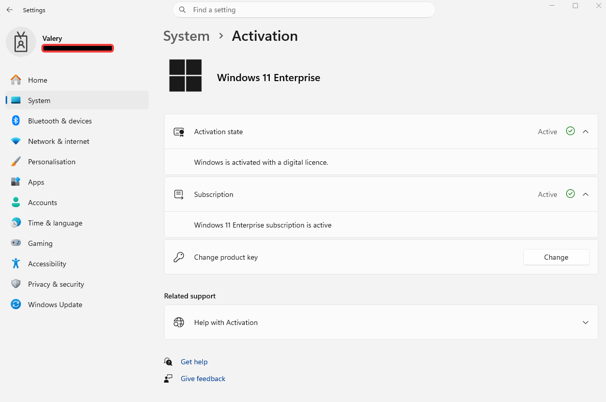

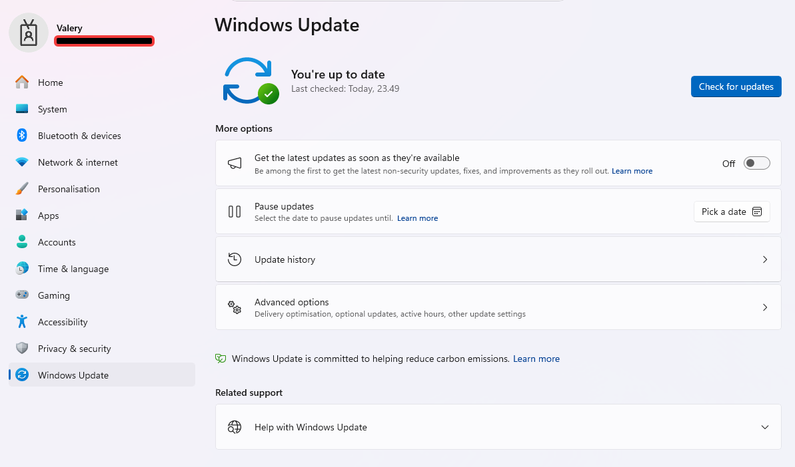

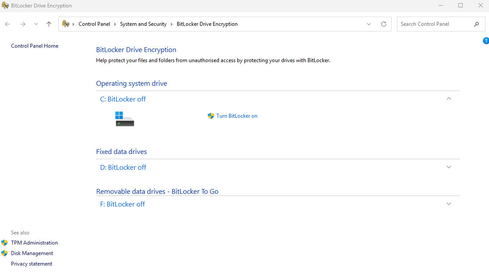

## Security and privacy review

- [x] Device ID and Product ID redacted where captured.
- [x] No passwords, authentication codes, recovery keys or secrets included.
- [x] Authoritative master repository remains private; this portfolio copy is separately sanitized.
- [x] Original and retrospective evidence are distinguished.
- [x] A repository-specific Git trust exception was used instead of a wildcard.
- [x] Sign-in addresses and unique Windows identifiers sanitized for this public portfolio copy on 2026-09-03.
- [ ] Confirm a secured local-administrator recovery method.
- [ ] Plan BitLocker enablement and recovery-key storage before changing encryption state.

## Final state

`BAEYO-WIN-01` is operational as the Baeyo Digital administration workstation. The local working structure and private GitHub repository are valid, the repository is synchronised with `origin/main`, Windows PowerShell 5.1 and PowerShell 7.6.4 are available, and the principal Microsoft 365 administration modules are installed.

The module is considered complete for documentation and workstation-readiness purposes, with three explicit follow-ups: restore/test local administrator access, plan BitLocker enablement, and install `Az` only if a later Azure task requires it.

## Lessons learned

- Capture the initial state before configuration whenever possible.
- Retrospective evidence is valid when it is clearly labelled and not misrepresented as original evidence.
- Revalidate tools after operating-system, account or profile changes because configuration drift can occur.
- Keep daily and privileged identities separate, while maintaining a tested recovery path for local administration.
- Verify repository ownership before bypassing Git safety checks, and trust only the required path.
- Do not enable encryption casually; confirm administrator access and recovery-key storage first.
- Completion includes documentation, validation and follow-up tracking—not only successful configuration clicks.

## Follow-up actions

| ID | Action | Priority | Owner | Status |
|---|---|---|---|---|
| F00-01 | Restore and test authorised local administrator access without disrupting the Entra-connected profile. | High | Valery | Open |
| F00-02 | Plan BitLocker enablement and recovery-key escrow before changing encryption state. | High | Valery | Open |
| F00-03 | Prepare a sanitized public evidence set while preserving the private master. | Medium | Valery | Complete — 2026-09-03 |
| F00-04 | Install `Az` only when an Azure administration task requires it. | Low | Valery | Deferred |
| F00-05 | Configure explicit Git identity before the next command-line commit if GitHub Desktop is not used. | Medium | Valery | Completed |
