# Module 01 — Identity, Groups, and Licensing

## Document status

| Field | Entry |
|---|---|
| Documentation type | Sanitized public portfolio copy |
| Documentation status | Approved for repository inclusion on 2026-08-19 |
| Original implementation | Completed before 2026-08-17; exact implementation dates were not fully evidenced |
| Licensing transition and retrospective validation | 2026-08-17 to 2026-08-19 |
| Implemented by | Valery |
| Tenant | Baeyo Digital |
| Primary domain | `baeyodigital.com` |
| Change reference | `CHG-0002` |
| Overall result | Implemented and validated, with one licensing follow-up |

> **Retrospective documentation notice:** Most identities, roles and groups were configured before a complete evidence process was in place. The E3-to-Business-Premium transition was captured while it occurred. Other screenshots are retrospective current-state validation and are not presented as original before-state evidence.

## Objective

Document and validate the Baeyo Digital identity model, account separation, Microsoft 365 role assignments, security groups, group membership and licensing position. Record the transition from Microsoft 365 E3 to Microsoft 365 Business Premium without recreating working tenant objects solely for documentation.

## Business reason

Baeyo Digital requires separate daily and privileged identities, controlled administrative access, recovery accounts and purpose-based security groups. Licensing must support the active business user without unnecessarily licensing administrative or emergency-access accounts. Recording the E3 transition also provides an auditable explanation of the temporary overassignment and billing incident.

## Scope

### Included

- Users, usernames, user principal names and aliases.
- Separation of daily and privileged identities.
- Security-group existence and reviewed direct membership.
- Microsoft 365 and Microsoft Entra role assignments.
- Licence inventory and assignment.
- Microsoft 365 E3 trial-to-paid incident and Business Premium transition.
- Emergency-access identity status.
- Implementation, validation, troubleshooting and evidence records.

### Excluded or deferred

- Authentication methods and multifactor authentication.
- Conditional Access policy configuration.
- Intune enrolment, compliance and device configuration.
- Microsoft 365 Apps deployment.
- Exchange Online, shared mailboxes and mail flow.
- SharePoint, Teams and Power Platform configuration.

These areas are documented in later modules.

## Evidence basis

This module uses two evidence classes:

1. **Contemporaneous transition evidence** captured while the E3 licensing and billing issue was being resolved and Business Premium was activated.
2. **Retrospective/current-state validation** captured after the original identity and group configuration had already been completed.

No current-state screenshot is described as an original before-state screenshot. Support-contact and invoice screenshots were retained privately for troubleshooting but excluded from the permanent repository evidence set because they were redundant or contained unnecessary personal and billing information.

## Design decisions

| Decision | Selected approach | Reason |
|---|---|---|
| Daily identity | Use `daily-user@baeyodigital.example` for normal productivity | Keeps routine work away from privileged credentials. |
| Privileged identity | Use `tenant-admin@baeyodigital.example` for tenant administration | Provides a dedicated administrative identity and supports least privilege. |
| Administrator licensing | Keep `tenant-admin` unlicensed unless a workload explicitly requires a licence | Administrative directory work does not require a productivity licence. |
| Test identity | Keep `lab-user@baeyodigital.example` unlicensed until a test requires a licence | Avoids consuming a paid seat when the account is not actively testing a licensed workload. |
| Emergency access | Maintain two cloud-only `onmicrosoft.com` recovery identities | Preserves tenant access if the custom domain or normal administrator identity is unavailable. |
| Emergency licensing | Keep both emergency-access identities unlicensed | Recovery identities do not require routine productivity services. |
| Production licence | Assign Microsoft 365 Business Premium directly to `valery` | One active licensed user does not yet require group-based Business Premium assignment. |
| Legacy E3 group | Retain `LIC-M365-E3-Users` temporarily without a product assignment | Preserves the transition record without continuing E3 licensing. |
| Group model | Use purpose-based assigned security groups | Provides reusable assignment targets for later Microsoft 365 workloads. |

## Identity inventory

| Identity | Current username / UPN | Purpose | Licence state | Administrative state |
|---|---|---|---|---|
| Valery – Baeyo Digital | `daily-user@baeyodigital.example` | Daily productivity identity | Microsoft 365 Business Premium | No administrative role found during reviewed validation |
| Valery – Baeyo Tenant Admin | `tenant-admin@baeyodigital.example` | Dedicated privileged administration | Unlicensed | Global Administrator |
| Baeyo Lab Manager | `lab-user@baeyodigital.example` | Test and business-user scenarios | Unlicensed | No administrative role found during reviewed validation |
| Baeyo Emergency Access 01 | `emergency-access-01@tenant-name.onmicrosoft.com` | Cloud-only tenant recovery | Unlicensed | Global Administrator |
| Baeyo Emergency Access 02 | `emergency-access-02@tenant-name.onmicrosoft.com` | Cloud-only tenant recovery | Unlicensed | Global Administrator |

Additional unlicensed objects, including `admin-account@baeyodigital.example`, and the `info` and `support` objects were visible in the tenant. They were not changed during Module 01. Shared-mailbox and messaging configuration belongs to the Exchange module.

## Username and alias validation

The daily and dedicated administrator identities use the verified `baeyodigital.com` custom domain:

- `daily-user@baeyodigital.example`
- `tenant-admin@baeyodigital.example`
- `lab-user@baeyodigital.example`

The daily identity retains `daily-user@tenant-name.onmicrosoft.com` as an alias. The tenant's custom domain, DNS and service records are tenant-level configuration and are not tied to a specific user licence. Changing from E3 to Business Premium therefore did not require the domain or DNS configuration to be recreated.

The emergency-access identities intentionally retain the tenant's `onmicrosoft.com` domain so that recovery does not depend on the custom domain.

## Administrative role assignments

The Global Administrator assignment list was reviewed as a consolidated control point. It contained exactly three identities at directory scope:

- `tenant-admin@baeyodigital.example`
- `emergency-access-01@tenant-name.onmicrosoft.com`
- `emergency-access-02@tenant-name.onmicrosoft.com`

The daily `valery` identity and `lab-user` were separately reviewed and confirmed without administrative roles. This maintains the intended separation between productivity, testing and privileged administration.

## Group inventory

| Group | Type / membership | Verified purpose or current status |
|---|---|---|
| `LIC-M365-E3-Users` | Security / Assigned | Legacy E3 assignment group retained without an active product assignment. |
| `SG-PP-Makers` | Security / Assigned | Power Platform maker assignment target; existence validated. |
| `SG-PP-Users` | Security / Assigned | Power Platform user assignment target; existence validated. |
| `SG-Intune-Windows-Users` | Security / Assigned | Intune Windows user assignment target; existence validated. |
| `SG-Intune-Windows-Devices` | Security / Assigned | Additional Windows device assignment target; existence validated. |
| `SG-Baeyo-All-Staff` | Security / Assigned | General staff assignment group; membership reviewed. |
| `SG-CA-Pilot-Users` | Security / Assigned | Conditional Access pilot target; existence validated only in this module. |
| `SG-CA-Emergency-Access` | Security / Assigned | Emergency-access exclusion/target group; membership reviewed. |

The Power Platform, Intune and Conditional Access groups are recorded here as identity objects. Their workload assignments and policy behaviour are validated in their respective later modules.

## Reviewed direct group membership

| Group | Direct members validated | Result |
|---|---|---|
| `LIC-M365-E3-Users` | `lab-user`, `valery`, `tenant-admin` | Three legacy members retained; the group has no current product assignment. |
| `SG-Baeyo-All-Staff` | `lab-user`, `valery` | Daily and test/business identities included; privileged and emergency identities excluded. |
| `SG-CA-Emergency-Access` | Emergency Access 01 and Emergency Access 02 | Both recovery identities included. |

The remaining target groups were confirmed to exist. Their individual memberships were not reopened solely to manufacture additional screenshots; the tenant owner confirmed that the established configuration remained intentional.

## Licensing inventory and transition record

### Microsoft 365 E3 state

The tenant originally used a Microsoft 365 E3 trial. After the trial period, E3 entered a paid state with one purchased seat while four users remained assigned. The administration page therefore showed `4/1 assigned` and reported three more assigned members than available licences.

The affected identities shown at that point were:

- Baeyo Lab Manager
- Baeyo Emergency Access 01
- Valery – Baeyo Digital
- Valery – Baeyo Tenant Admin

Microsoft Support was contacted because the paid renewal and attempted card charge were not intended. Support disabled the E3 subscription, and the product later showed `Expired`. Microsoft billing support confirmed to the tenant owner that there would be no continuing E3 charge.

### Microsoft 365 Business Premium state

A Microsoft 365 Business Premium trial was activated during the transition. The validated state showed:

- Subscription status: Active
- Trial seats: 25
- Assigned seats: 1
- Assigned user: `daily-user@baeyodigital.example`
- Trial expiry date: 2026-09-16
- Scheduled paid-plan start: 2026-09-17
- Recurring billing: On

The dedicated administrator, lab user and both emergency-access identities remain unlicensed. The custom domain and its DNS configuration continued unchanged because those tenant settings are independent of the E3 or Business Premium user licence assignment.

### Legacy licensing group

`LIC-M365-E3-Users` still contains its three historical direct members, but its Licenses page reports `No license assignments found`. It no longer grants E3 or any other product. Retaining the group during this documentation cycle preserves the transition history and does not consume licences.

## Implementation record

| Step | Configuration | Reason | Evidence | Result |
|---:|---|---|---|---|
| 1 | Inventoried the core daily, privileged, test and emergency identities | Establish the verified tenant state before making recommendations | E01-04, E01-05 | Complete |
| 2 | Confirmed custom-domain UPNs and the retained daily-user `onmicrosoft.com` alias | Validate the completed custom-domain transition | E01-05 | Complete |
| 3 | Confirmed separation of the licensed daily identity from the unlicensed Global Administrator identity | Reduce privileged-account exposure and unnecessary licensing | E01-04, E01-08 | Complete |
| 4 | Confirmed two unlicensed cloud-only emergency-access identities and their Global Administrator assignments | Preserve independent tenant recovery | E01-08, E01-11 | Complete |
| 5 | Validated the planned security-group inventory and selected direct memberships | Confirm reusable assignment targets without recreating objects | E01-06, E01-07, E01-10, E01-11 | Complete |
| 6 | Recorded the E3 overassignment and subsequent expired state | Preserve the licensing and billing transition history | E01-01, E01-02 | Complete |
| 7 | Activated Business Premium and assigned it only to the daily productivity user | Replace E3 with the intended small-business subscription | E01-03, E01-04 | Complete |
| 8 | Confirmed that the legacy E3 group has no current licence assignment | Ensure retained membership cannot continue E3 licensing | E01-09 | Complete |

## Troubleshooting record

### TRB-01-01 — E3 trial converted to a paid subscription

| Field | Record |
|---|---|
| Symptom | Microsoft 365 E3 showed one purchased licence, four assigned users and an attempted card charge after the trial period. |
| Risk | Continued E3 billing and service disruption caused by overassignment. |
| Action | Opened a Microsoft support request and explained that E3 was not the intended continuing subscription. |
| Resolution | Microsoft Support disabled E3; its product state showed `Expired`. Billing support confirmed no continuing E3 charge to the tenant owner. |
| Validation | E3 expired-state evidence retained; Business Premium became the active replacement. |
| Lesson | Review recurring billing, seat quantity and licence assignment before a trial reaches its conversion date. |

### TRB-01-02 — Business Premium replacement and user licensing

| Field | Record |
|---|---|
| Symptom | Productivity services required a replacement licence after E3 was disabled. |
| Action | Activated a one-month Microsoft 365 Business Premium trial and reviewed user assignments. |
| Resolution | Assigned Business Premium only to `daily-user@baeyodigital.example`; privileged, test and recovery accounts remained unlicensed. |
| Validation | The Business Premium subscription showed active with one of 25 trial seats assigned, and Active users showed the intended licence distribution. |
| Lesson | Assign the replacement licence before relying on the expired product, and license only identities that require the services. |

### TRB-01-03 — Legacy group name implied active E3 licensing

| Field | Record |
|---|---|
| Symptom | `LIC-M365-E3-Users` remained visible after E3 was disabled. |
| Finding | The group retained three historical members but its Licenses page showed no product assignments. |
| Resolution | No emergency deletion or membership recreation was required. The group was retained as a clearly documented legacy object. |
| Validation | Group membership and the empty licence-assignment state were captured separately. |
| Lesson | A licensing-style group name does not prove that the group currently assigns a product; validate the Licenses page. |

## Verification results

| Test ID | Test | Expected result | Actual result | Status |
|---|---|---|---|---|
| T01-01 | Confirm core identities and usernames | Daily, privileged and lab identities use intended custom-domain UPNs | All three verified with `baeyodigital.com` UPNs | Pass |
| T01-02 | Confirm daily-user alias | Original tenant-domain address remains available | `daily-user@tenant-name.onmicrosoft.com` retained as alias | Pass |
| T01-03 | Confirm daily/admin separation | Daily identity is licensed and non-admin; admin identity is separate and unlicensed | Intended separation confirmed | Pass |
| T01-04 | Review Global Administrators | Only the dedicated admin and two recovery identities are listed | Exactly three assignments at directory scope | Pass |
| T01-05 | Confirm emergency-access identities | Two cloud-only, unlicensed recovery accounts exist | Both accounts present, grouped and assigned Global Administrator | Pass |
| T01-06 | Confirm planned security groups | All planned groups exist | All seven target groups plus the Windows device group found | Pass |
| T01-07 | Review selected direct memberships | Members align with each reviewed group purpose | E3 legacy, all-staff and emergency memberships validated | Pass |
| T01-08 | Confirm legacy E3 group licence state | No current product assignment | `No license assignments found` | Pass |
| T01-09 | Confirm E3 transition | E3 no longer active | Subscription displayed as expired after support action | Pass |
| T01-10 | Confirm Business Premium replacement | Active subscription and daily-user assignment | Active trial; one of 25 seats assigned to `valery` | Pass |
| T01-11 | Confirm custom-domain continuity | Licence change does not require domain/DNS recreation | Existing custom-domain usernames remained operational | Pass |

## Definitive evidence inventory

All paths below are relative to `docs/01-identity-groups-licensing.md`.

| Evidence ID | Filename | Classification | What it proves |
|---|---|---|---|
| E01-01 | `01-01-e3-overassignment-before-transition.png` | Contemporaneous transition / primary | E3 had one purchased seat, four assigned users and an overassignment warning before resolution. |
| E01-02 | `01-02-e3-expired-subscription-state-redacted.png` | Contemporaneous transition / primary | E3 displayed as expired after support action; subscription identifier redacted. |
| E01-03 | `01-03-business-premium-trial-active.png` | Contemporaneous transition / primary | Business Premium trial active, one of 25 seats assigned, conversion dates and recurring-billing state. |
| E01-04 | `01-04-user-licensing-current-state.png` | Retrospective current state / primary | Business Premium assigned only to `valery`; reviewed administrative, lab and recovery identities unlicensed. |
| E01-05 | `01-05-valery-upn-and-alias-current-state.png` | Retrospective current state / primary | Daily-user custom-domain UPN and retained tenant-domain alias. |
| E01-06 | `01-06-security-groups-current-state-redacted.png` | Retrospective current state / primary | Planned security groups exist; object identifiers redacted. |
| E01-07 | `01-07-e3-licensing-group-members-current-state-redacted.png` | Retrospective current state / supporting | Three direct members of the legacy E3 group; object identifiers redacted. |
| E01-08 | `01-08-global-administrator-assignments-current-state.png` | Retrospective current state / primary | Consolidated Global Administrator assignment list contains the dedicated admin and two recovery identities. |
| E01-09 | `01-09-e3-group-no-active-license-assignment.png` | Retrospective current state / primary | Legacy E3 group has no active product licence assignment. |
| E01-10 | `01-10-all-staff-group-members-current-state-redacted.png` | Retrospective current state / supporting | `lab-user` and `valery` are the reviewed all-staff members; object identifiers redacted. |
| E01-11 | `01-11-emergency-access-group-members-current-state-redacted.png` | Retrospective current state / primary | Both cloud-only recovery identities are members of the emergency-access group; object identifiers redacted. |

## Evidence links

### Licensing transition

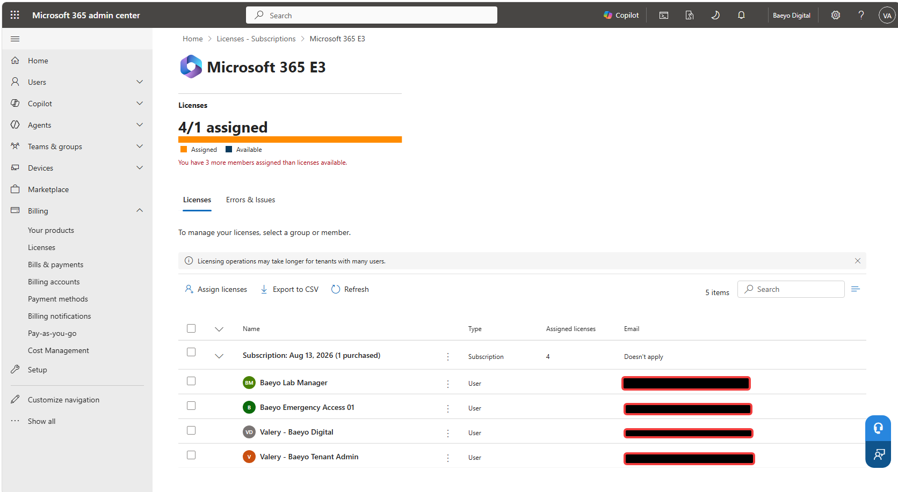

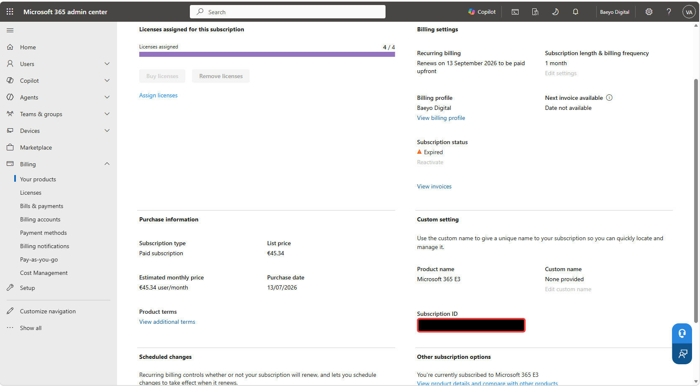

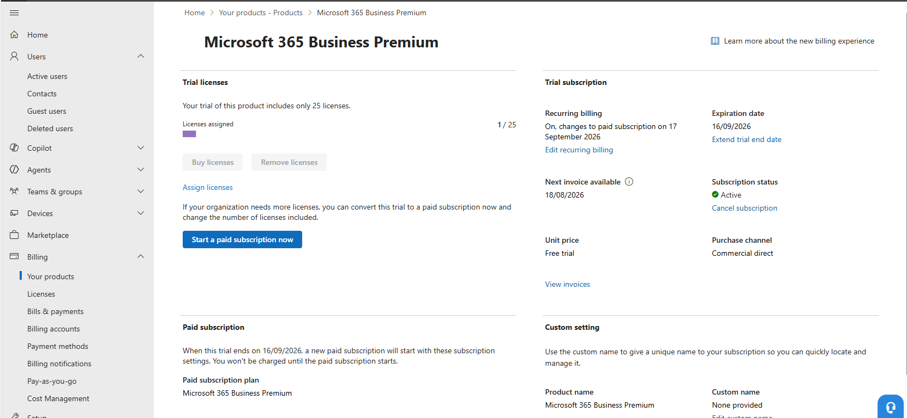

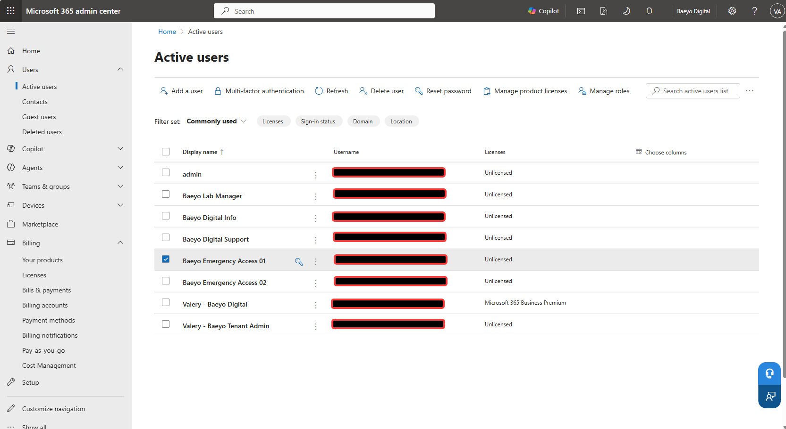

### Identities and administrative roles

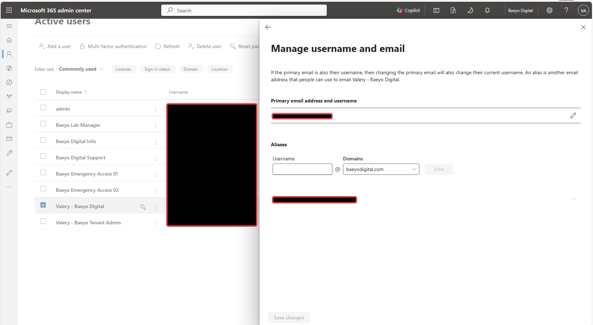

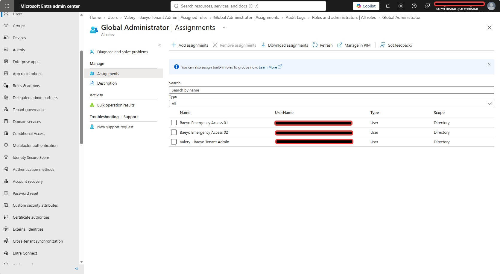

### Groups and membership

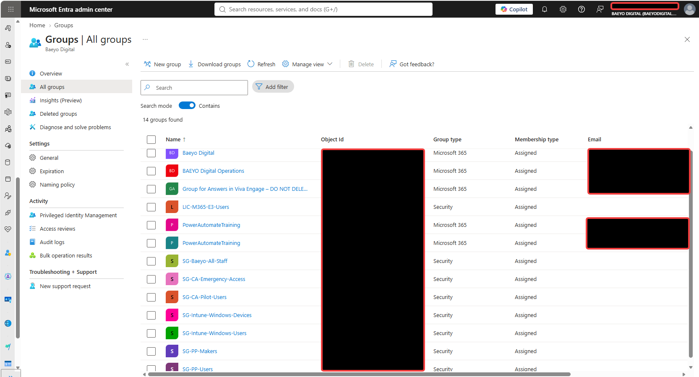

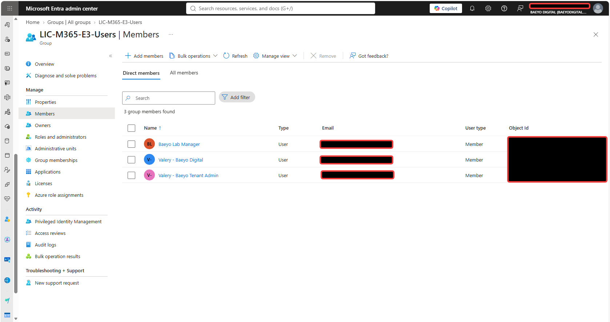

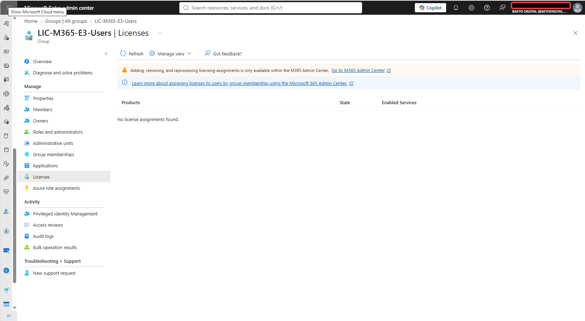

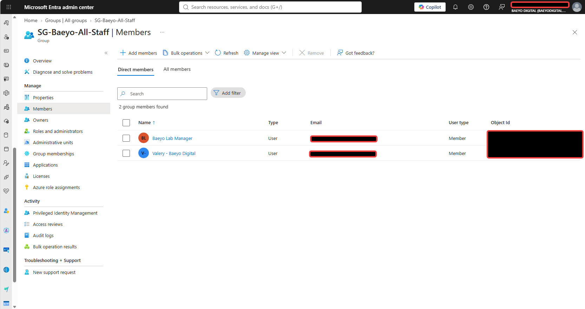

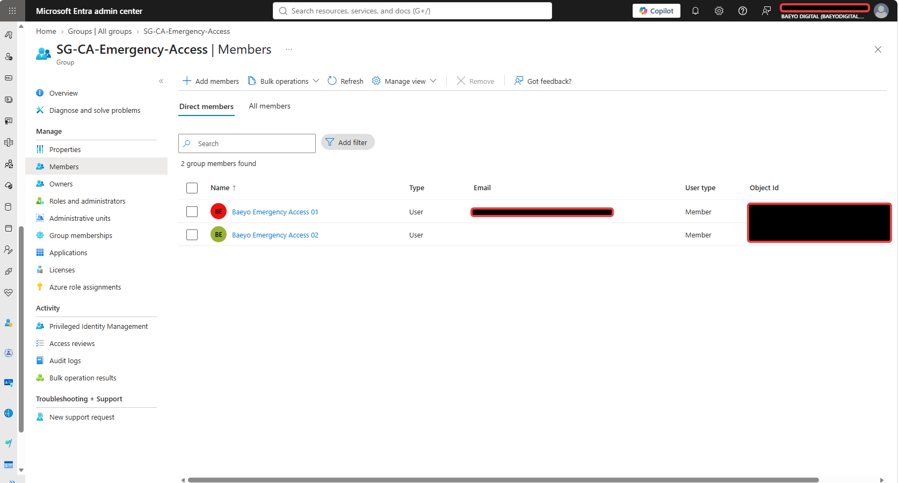

## Security and privacy review

- [x] No passwords, authentication codes, recovery information or payment-card details included.
- [x] Subscription and object identifiers redacted where selected for the repository.
- [x] Support screenshots containing a telephone number excluded.
- [x] Detailed invoice screenshot excluded from the permanent evidence set.
- [x] Original/contemporaneous and retrospective evidence clearly distinguished.
- [x] Daily and privileged identities separated.
- [x] Privileged and emergency-access identities kept unlicensed.
- [x] Authoritative master repository remains private; this portfolio copy is separately sanitized.
- [x] Sign-in identities anonymized for this public portfolio copy on 2026-09-03.

## Evidence limitations

- No reliable original before-state screenshots were available for the identity and group creation steps.
- Group-list evidence proves the existence and type of the displayed groups but does not prove every group's full membership.
- Selected memberships were validated only for the legacy E3, all-staff and emergency-access groups.
- The consolidated Global Administrator list proves membership of that role; the owner separately confirmed that `valery` and `lab-user` had no other administrative roles during the reviewed validation.
- Microsoft's billing confirmation was provided by telephone. The documentation records the tenant owner's account of the confirmation without publishing personal support or invoice details.
- Business Premium was still a trial at the time of capture; its later paid state is therefore a follow-up rather than a completed validation claim.

## Final state

Baeyo Digital has a separated identity model: `valery` is the licensed daily productivity identity, `tenant-admin` is the unlicensed dedicated Global Administrator, and `lab-user` remains an unlicensed test identity until licensed testing is required. Two unlicensed cloud-only emergency-access identities provide independent tenant recovery and are grouped for later policy handling.

All planned Module 01 security groups exist. The reviewed all-staff and emergency-access memberships align with their intended purposes. The legacy E3 group remains for transition history but has no active licence assignment.

Microsoft 365 E3 was disabled after the unintended paid conversion and is shown as expired. Microsoft 365 Business Premium is the active replacement, with one trial seat assigned to `valery`. No further Module 01 tenant change is required at this stage.

## Lessons learned

- Verify the current tenant state before recreating users, groups, roles or licences from a documentation template.
- Review trial conversion dates, recurring billing and seat quantities before the renewal date.
- Keep daily productivity, privileged administration and emergency recovery identities distinct.
- Use the tenant's `onmicrosoft.com` domain for emergency-access identities so recovery does not depend on the custom domain.
- A custom domain and its DNS records remain tenant configuration when user licence products change.
- Validate the product assignment on a licensing group instead of inferring its effect from the group name.
- Retrospective evidence is suitable for an honest portfolio record when it is clearly classified and its limitations are stated.

## Follow-up actions

| ID | Action | Priority | Owner | Status |
|---|---|---|---|---|
| F01-01 | Before 2026-09-16, confirm the required paid Business Premium seat quantity and verify that only the intended Business Premium charge will begin on 2026-09-17. | High | Valery | Open |
| F01-02 | Rename or archive `LIC-M365-E3-Users` only if its legacy name causes operational confusion; do not recreate its members merely for documentation. | Low | Valery | Deferred |
| F01-03 | Prepare a sanitized public portfolio copy while preserving the private master. | Medium | Valery | Complete — 2026-09-03 |
