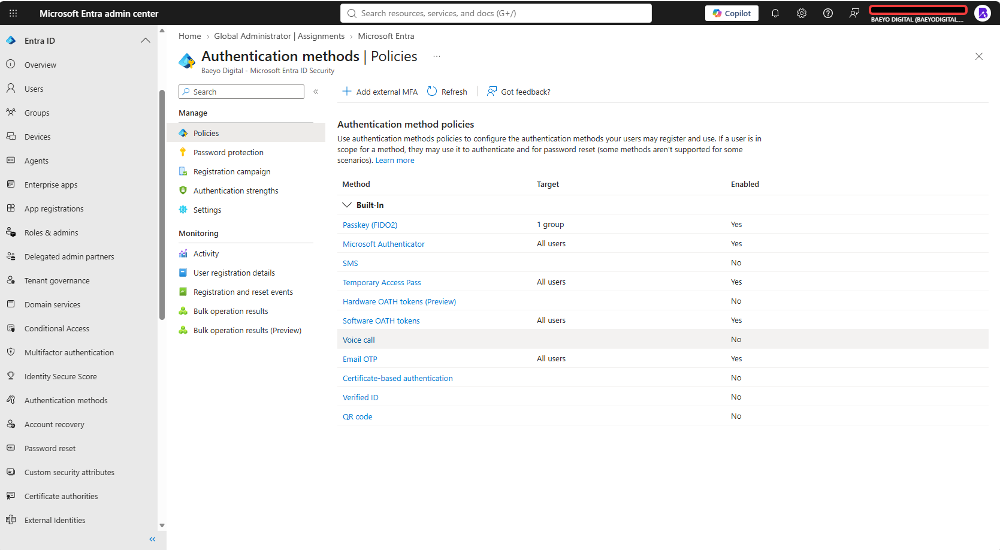
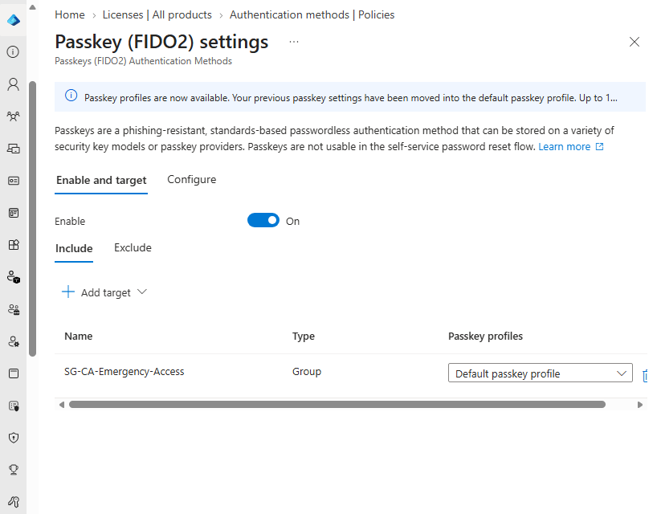
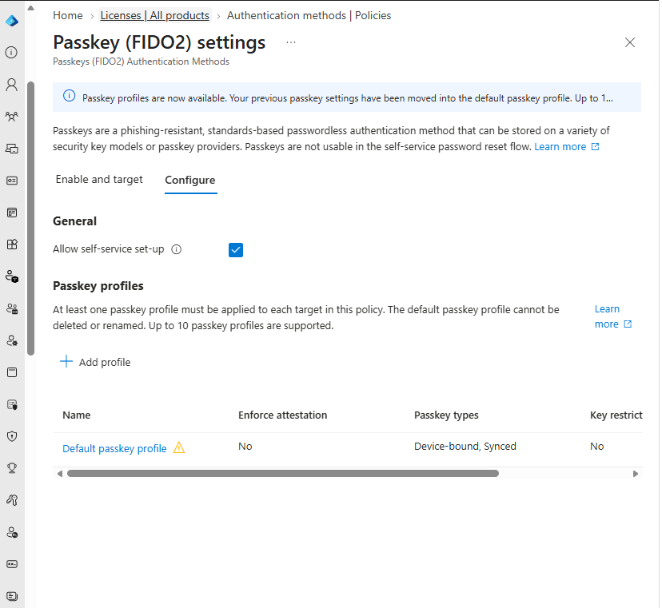
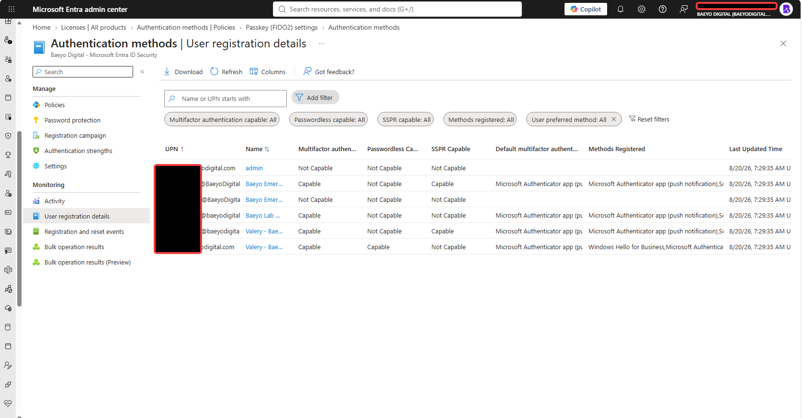
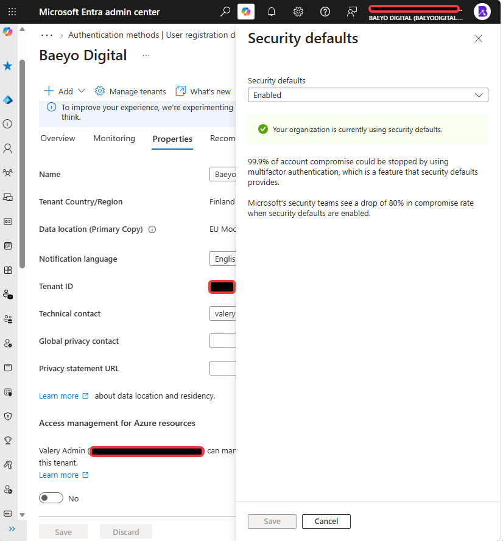
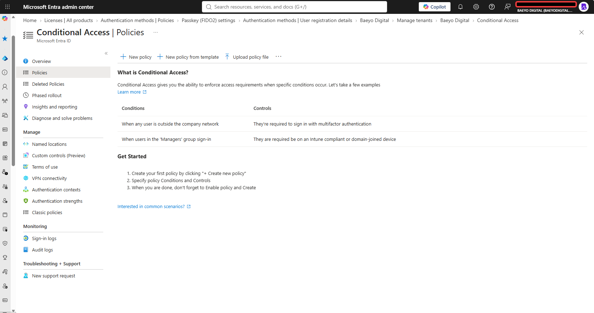

# Module 02 — Authentication and Entra Security

## Document status

| Field | Entry |
|---|---|
| Documentation type | Sanitized public portfolio copy |
| Documentation status | Approved for repository inclusion on 2026-08-20 |
| Original implementation | Completed before 2026-08-20; exact implementation dates were not fully evidenced |
| Retrospective validation | 2026-08-20 |
| Implemented by | Valery |
| Tenant | Baeyo Digital |
| Primary domain | `baeyodigital.com` |
| Change reference | `CHG-0003` |
| Overall result | Authentication controls implemented and retrospectively validated; Security Defaults is the active tenant-wide control model and no Conditional Access policies exist |

> **Retrospective documentation notice:** Authentication and security configuration was completed before a complete evidence process was in place. The screenshots in this module are retrospective/current-state validation. They are not presented as original before-state or implementation screenshots.

## Objective

Document and validate the authentication-method policy, multifactor-authentication readiness, passkey targeting, emergency-access authentication position, Security Defaults status and Conditional Access inventory for the Baeyo Digital tenant without recreating or changing working controls solely for documentation.

## Business reason

Baeyo Digital requires strong authentication for daily and privileged administration, independent emergency-access identities and a clearly understood tenant-wide access-control model. Retrospective documentation provides an auditable record while avoiding unnecessary configuration changes or tenant-lockout risk.

## Scope

### Included

- Authentication-method policy inventory.
- Microsoft Authenticator, Passkey (FIDO2), Temporary Access Pass and other configured method states.
- Authentication-method targeting.
- MFA and passwordless capability for the reviewed daily, privileged, test and emergency-access identities.
- Passkey profile configuration.
- Security Defaults status.
- Conditional Access policy inventory and current applicability.
- Emergency-access authentication observations.
- Sanitized current-state evidence.

### Excluded or deferred

- User creation, UPN changes, licensing, directory-role changes and general group design.
- Windows configuration, Microsoft Entra device join and Intune.
- Microsoft 365 Apps, Exchange, SharePoint, Teams and OneDrive.
- Power Platform.
- New Conditional Access deployment or unrelated security improvements.

The underlying identities, Global Administrator assignments and security-group memberships were documented in Module 01 and were not recreated or re-documented as Module 02 implementation tasks.

## Evidence basis

This module uses **retrospective/current-state validation** captured on 2026-08-20. No screenshot is described as original implementation evidence.

Earlier implementation history establishes that Module 02 was designed around MFA, passkeys, two emergency-access accounts and a deliberate choice between Security Defaults and Conditional Access. The exact before-state of the earlier passkey-targeting correction was not recovered. The current tenant state is therefore the authoritative evidence for the final documented configuration.

The phone photograph used only to read the passkey-profile warning tooltip is temporary progress verification and is excluded from the permanent evidence set.

## Definitive status inventory

| Area | Classification | Verified position |
|---|---|---|
| Authentication-method policy | Historically completed; retrospectively evidenced | Multiple methods are configured with explicit enabled/disabled states and targets. |
| MFA for daily and dedicated administrator accounts | Historically completed; retrospectively evidenced | `valery` and `tenant-admin` are both shown as MFA capable. |
| Passkey targeting | Historically completed; earlier correction lacks before-state evidence | Passkey (FIDO2) is enabled for `SG-CA-Emergency-Access`, not `SG-CA-Pilot-Users`. |
| Passkey profile | Historically completed; retrospectively evidenced | Default profile assigned; self-service setup enabled; device-bound and synced passkeys allowed. |
| Emergency Access 01 authentication | Retrospectively evidenced | MFA capable; not passwordless capable. |
| Emergency Access 02 authentication | Retrospectively evidenced current-state observation | Not MFA capable and not passwordless capable at validation time. No secret or credential-storage details were inspected. |
| Security Defaults | Verifiable current state | Enabled and confirmed as the active tenant-wide control model. |
| Conditional Access policies | Not implemented under the current control model | Policy inventory is empty. No report-only, enabled or disabled policies exist. |
| Conditional Access pilot assignments and emergency exclusions | Not applicable in the current state | There are no Conditional Access policies to assign or exclude. The existing groups remain available for a future controlled transition. |

## Design decisions

| Decision | Selected approach | Reason |
|---|---|---|
| Administrative portal identity | Use `tenant-admin@baeyodigital.example` for privileged administration | Keeps privileged activity separate from normal productivity. |
| Daily-user testing | Use `daily-user@baeyodigital.example` only for normal-user validation | Preserves the daily/admin separation established in Module 01. |
| Authentication-method management | Use the Microsoft Entra Authentication methods policy | Provides one current policy surface for method states and targeting. |
| Passkey target | Target `SG-CA-Emergency-Access` | Makes the Passkey (FIDO2) method available to the two emergency-access identities and keeps it separate from `SG-CA-Pilot-Users`. |
| Passkey profile | Use the default passkey profile | Retains the tenant's migrated passkey configuration without unnecessary recreation. |
| Tenant-wide access model | Use Security Defaults in the current tenant state | Provides the active baseline without simultaneously enforcing custom Conditional Access policies. |
| Conditional Access | Maintain no policies in the current state | Avoids conflicting control models and prevents unapproved lockout-sensitive changes. |
| Evidence method | Capture sanitized current state | Preserves honest evidence without recreating historical before/after conditions. |

## Authentication-method policy inventory

| Method | Target shown | State |
|---|---|---|
| Passkey (FIDO2) | One group | Enabled |
| Microsoft Authenticator | All users | Enabled |
| SMS | None shown | Disabled |
| Temporary Access Pass | All users | Enabled |
| Hardware OATH tokens (Preview) | None shown | Disabled |
| Software OATH tokens | All users | Enabled |
| Voice call | None shown | Disabled |
| Email OTP | All users | Enabled |
| Certificate-based authentication | None shown | Disabled |
| Verified ID | None shown | Disabled |
| QR code | None shown | Disabled |

The policy overview establishes method availability and targeting. It does not by itself prove that every targeted identity registered every available method.

## Passkey (FIDO2) configuration

### Enablement and targeting

| Setting | Verified value |
|---|---|
| Passkey (FIDO2) | On |
| Included target | `SG-CA-Emergency-Access` |
| Excluded targets | None |
| Assigned profile | Default passkey profile |

Module 01 established that `SG-CA-Emergency-Access` contains:

- `emergency-access-01@tenant-name.onmicrosoft.com`
- `emergency-access-02@tenant-name.onmicrosoft.com`

The current assignment does not use `SG-CA-Pilot-Users`, preserving separation between authentication-method targeting and the Conditional Access pilot group.

### Default passkey profile

| Setting | Verified value |
|---|---|
| Allow self-service setup | Enabled |
| Enforce attestation | No |
| Passkey types | Device-bound and synced |
| Key restrictions | No |

The portal displayed an advisory that the profile includes type restrictions while attestation is not enforced. No configuration change was made during retrospective validation.

## Authentication registration status

| Identity | MFA capable | Passwordless capable | SSPR capable | Validation result |
|---|---:|---:|---:|---|
| `daily-user@baeyodigital.example` | Yes | Yes | No | Daily-user MFA and passwordless readiness evidenced |
| `tenant-admin@baeyodigital.example` | Yes | No | Yes | Dedicated administrator MFA readiness evidenced |
| `lab-user@baeyodigital.example` | Yes | No | No | Test-user MFA readiness evidenced |
| `emergency-access-01@tenant-name.onmicrosoft.com` | Yes | No | Yes | Emergency Access 01 MFA readiness evidenced |
| `emergency-access-02@tenant-name.onmicrosoft.com` | No | No | No | Current state recorded; no method or secret was added during documentation |

The registration-details view also showed registered methods for capable accounts. Method strings were partially truncated in the portal table, so the evidence is used to support capability status rather than to claim a complete per-user method inventory.

## Security Defaults and Conditional Access

### Security Defaults

Security Defaults is **Enabled**. The portal explicitly confirmed that the organization is currently using Security Defaults.

### Conditional Access

The Conditional Access Policies page contained no policies and displayed the first-policy guidance. Therefore:

- No Conditional Access policy is enabled.
- No Conditional Access policy is in report-only mode.
- No Conditional Access policy is disabled.
- `SG-CA-Pilot-Users` has no Conditional Access policy assignment.
- `SG-CA-Emergency-Access` has no Conditional Access policy exclusion because there is no policy from which to exclude it.

The tenant is not relying on Security Defaults and Conditional Access as competing enforcement models. Security Defaults is the only evidenced active tenant-wide model.

## Emergency-access position

Module 01 established two cloud-only, unlicensed emergency-access identities with Global Administrator assignments and confirmed that both are members of `SG-CA-Emergency-Access`.

Module 02 adds the following authentication-specific findings:

- The emergency-access group is the enabled Passkey (FIDO2) policy target.
- Emergency Access 01 is shown as MFA capable.
- Emergency Access 02 is shown as not MFA capable and not passwordless capable at the time of validation.
- No Conditional Access policy exists, so there is no effective Conditional Access exclusion to validate.
- Passwords, recovery codes, passkey secrets, private keys and credential-storage contents were neither requested nor captured.

## Implementation record

| Step | Configuration or validation | Reason | Evidence | Result |
|---:|---|---|---|---|
| 1 | Configured the tenant Authentication methods policy | Establish approved methods and targeting | E02-01 | Complete |
| 2 | Enabled Microsoft Authenticator and other selected methods while leaving unused methods disabled | Provide strong authentication options without enabling every available method | E02-01 | Complete |
| 3 | Enabled Passkey (FIDO2) for `SG-CA-Emergency-Access` | Scope passkey availability to the recovery identities and separate it from the CA pilot group | E02-02 | Complete |
| 4 | Retained the migrated default passkey profile with self-service setup | Preserve the completed passkey configuration | E02-03 | Complete |
| 5 | Registered authentication for the daily and dedicated administrator identities | Support MFA for routine and privileged access | E02-04 | Complete |
| 6 | Reviewed emergency-access authentication capability without viewing secrets | Record recovery-account readiness safely | E02-04 | Complete with current-state observation |
| 7 | Confirmed Security Defaults as the active tenant-wide model | Establish the actual control model before assessing Conditional Access | E02-05 | Complete |
| 8 | Confirmed that no Conditional Access policies exist | Avoid falsely documenting pilot assignments or exclusions | E02-06 | Complete; Conditional Access not implemented |

## Historical implementation and troubleshooting notes

### HIST-02-01 — Passkey target correction

The starter template records that the passkey authentication-method assignment was corrected during the original setup and that authentication-method targeting must remain separate from the Conditional Access pilot group. The original incorrect before-state screenshot was not recovered.

Current-state validation shows Passkey (FIDO2) enabled for `SG-CA-Emergency-Access`; `SG-CA-Pilot-Users` is not the authentication-method target. This current state is documented without recreating the historical error.

### OBS-02-01 — Passkey profile migration advisory

The portal reported that previous passkey settings had been moved into the default passkey profile. The profile displayed a warning because passkey-type restrictions were present while attestation was not enforced. The observation was recorded, but no profile change was made during retrospective documentation.

### OBS-02-02 — Conditional Access template target versus implemented state

The starter template anticipated Conditional Access pilot policies. Current evidence shows Security Defaults enabled and an empty Conditional Access policy inventory. The Conditional Access target is therefore classified as not implemented/not currently applicable rather than falsely documented as complete.

## Verification results

| Test ID | Test | Expected result | Actual result | Status |
|---|---|---|---|---|
| T02-01 | Review authentication-method policy | Configured method states and targets are visible | Enabled and disabled methods inventoried | Pass |
| T02-02 | Verify daily-user MFA capability | `valery` is MFA capable | MFA capable and passwordless capable | Pass |
| T02-03 | Verify dedicated administrator MFA capability | `tenant-admin` is MFA capable | MFA capable | Pass |
| T02-04 | Verify passkey targeting | Passkey method uses the intended group and not the CA pilot group | `SG-CA-Emergency-Access` targeted; `SG-CA-Pilot-Users` not targeted | Pass |
| T02-05 | Verify passkey profile | Current profile settings are visible | Default profile, self-service enabled, device-bound and synced types | Pass with advisory |
| T02-06 | Verify emergency-access authentication position | Current capability is recorded without exposing secrets | Emergency Access 01 capable; Emergency Access 02 not capable | Observation recorded |
| T02-07 | Determine active tenant-wide control model | One clear model is active | Security Defaults enabled | Pass |
| T02-08 | Inventory Conditional Access policies | All policy states can be identified | No policies exist | Pass; not implemented |
| T02-09 | Check pilot assignments and emergency exclusions | Assess only if policies exist | Not applicable because policy inventory is empty | Not applicable |

## Definitive evidence inventory

All paths below are relative to `docs/02-authentication-security.md`.

| Evidence ID | Filename | Classification | What it proves | Required sanitization |
|---|---|---|---|---|
| E02-01 | `02-01-authentication-methods-policy-current-state.png` | Retrospective current state / primary | Authentication-method inventory, targets and enabled/disabled states | Crop only if needed; no secrets visible |
| E02-02 | `02-02-passkey-fido2-target-current-state.png` | Retrospective current state / primary | Passkey enabled for `SG-CA-Emergency-Access`, using the default passkey profile | No secrets visible |
| E02-03 | `02-03-passkey-fido2-configuration-current-state.png` | Retrospective current state / supporting | Self-service, attestation, passkey types and key-restriction settings | No secrets visible |
| E02-04 | `02-04-user-registration-details-current-state.png` | Retrospective current state / primary | MFA, passwordless and SSPR capability of reviewed identities | Preserve intended UPNs; crop unrelated empty space if desired |
| E02-05 | `02-05-security-defaults-current-state.png` | Retrospective current state / primary | Security Defaults enabled | Public copy retains the full Entra portal context with tenant-specific identifiers and contact details sanitized |
| E02-06 | `02-06-conditional-access-policy-inventory-current-state.png` | Retrospective current state / primary | Conditional Access policy inventory is empty | No secrets visible |

The tooltip phone photograph is excluded from the permanent evidence inventory.

## Evidence links

### Authentication methods and passkeys

### Registration status

### Tenant-wide access-control model

## Security and privacy notes

- No passwords, Temporary Access Pass values, recovery codes, tokens, private keys or complete phone numbers are stored.
- The public Security Defaults screenshot retains the Microsoft Entra header and surrounding navigation context while tenant-specific identifiers and contact details are sanitized.
- Public documentation uses anonymized UPN placeholders; the private master retains the established Baeyo Digital lab identities.
- Screenshots are classified honestly as retrospective/current-state evidence.
- No authentication method, Security Defaults setting or Conditional Access policy was changed during documentation.

## Lessons learned

- Authentication-method policy enablement and individual user registration are separate evidence points.
- A starter template records intended controls but does not prove the implemented tenant state.
- Security Defaults and Conditional Access must be documented as alternative control models; the validated Baeyo Digital state uses Security Defaults.
- Empty Conditional Access inventory is valid evidence and avoids inventing policy assignments or exclusions.
- Retrospective evidence must not be described as original implementation evidence.

## Closure

Module 02 documentation and its six-file evidence set were approved and merged on 2026-08-20.

The repository-wide audit on 2026-09-02 confirmed that E02-05 should retain the complete Microsoft Entra portal context. The public copy was sanitized on 2026-09-03 by masking tenant-specific identifiers and contact details; no tenant configuration change was required.
