# Module 03 — Windows, Microsoft Entra Join, and Intune

## Document status

| Field | Entry |
|---|---|
| Documentation type | Sanitized public portfolio copy |
| Documentation status | Approved and merged on 2026-08-24 |
| Original implementation | July 2026 |
| Retrospective validation | 2026-08-21 to 2026-08-22 |
| Implementation environment | Microsoft 365 E3 trial with Windows 11 Enterprise active |
| Retrospective validation environment | Microsoft 365 Business Premium with Windows 11 Pro active |
| Managed device | `BAEYO-WIN-01` |
| Daily user | `daily-user@baeyodigital.example` |
| Privileged administrator | `tenant-admin@baeyodigital.example` |
| Change reference | `CHG-0004` |
| Overall result | Microsoft Entra join, Intune enrollment, compliance, configuration processing, and account-separation state retrospectively validated |

## Objective

Establish and validate a Windows workstation that is Microsoft Entra joined, automatically enrolled in Microsoft Intune, assigned the intended Windows management controls, and operated day to day by a licensed non-administrative user.

This module records work largely completed during July 2026, when the tenant used a Microsoft 365 E3 trial and Windows 11 Enterprise was active on the device. By the August retrospective documentation period, the tenant had moved to Microsoft 365 Business Premium and Windows 11 Pro was active. The final evidence set therefore validates the current Business Premium and Windows 11 Pro end state while preserving the original E3 and Windows Enterprise implementation context. It does not recreate configuration actions or unsafe before-and-after scenarios.

## Scope and dependencies

Module 03 covers the Windows device identity, Microsoft Entra join, Intune enrollment, enrollment controls, compliance, Windows configuration processing, synchronization, and the relevant local Administrators group outcome.

Module 01 remains the authoritative record for the two user identities, the licensing transition from the earlier E3 trial to Microsoft 365 Business Premium, administrative role separation, and creation of `SG-Intune-Windows-Users` and `SG-Intune-Windows-Devices`. Those items are referenced here only where they affect enrollment, device state, or policy targeting; the licensing transition is not treated as a Module 03 implementation task.

Module 00 remains the authoritative record for the device rename. Its `00-08-device-rename-validation.png` evidence is referenced rather than duplicated.

Microsoft 365 Apps, Office installation, OneDrive, Edge, Conditional Access, collaboration services, and other later-module work are outside this module.

## Intended design

| Component | Intended state |
| --- | --- |
| Device identity | `BAEYO-WIN-01`, Windows 11 Pro |
| Join | Microsoft Entra joined |
| Management | Automatically enrolled in Microsoft Intune |
| Enrollment user | `daily-user@baeyodigital.example`, licensed and non-administrative |
| Administrative work | `tenant-admin@baeyodigital.example`, separate privileged identity |
| Intune ownership | Corporate |
| Primary user | `daily-user@baeyodigital.example` |
| User targeting | `SG-Intune-Windows-Users` |
| Device targeting | `SG-Intune-Windows-Devices` where applicable |
| Compliance | Windows baseline processed and device compliant |
| Configuration | Module 03 Windows baseline present and applicable device results succeeded |
| Local administration | Daily user not directly listed in the local Administrators group |

## Implementation record

### Environment timeline

The original Intune, Microsoft Entra join, policy, and troubleshooting work was performed while the Microsoft 365 E3 trial was active and the workstation was running with Windows 11 Enterprise active. The retained Module 03 screenshots were captured later, after Microsoft 365 Business Premium and Windows 11 Pro became the active licensing and operating-system context.

This distinction explains why the retrospective evidence shows Windows 11 Pro even though the implementation was originally performed under Windows Enterprise. The current screenshots are used only to prove that the completed Entra join and Intune management state remained healthy after the transition; they are not represented as evidence of the earlier E3 or Windows Enterprise state.

### 1. Automatic Mobile Device Management (MDM) enrollment

Mobile Device Management (MDM) is the Intune capability used to enroll organisational devices and centrally apply, monitor, and synchronize management policies. Microsoft Intune automatic enrollment was configured with **MDM user scope** set to **Some** and `SG-Intune-Windows-Users` selected. At implementation, the intended enrollment user, `daily-user@baeyodigital.example`, had the required Intune entitlement through Microsoft 365 E3. During retrospective validation, Microsoft 365 Business Premium provided the user’s current Intune entitlement. The pilot-group membership and licensing record remain documented in Module 01.

Windows Information Protection user scope was left at **None**. No enrollment-scope change was made during retrospective validation.

### 2. Windows enrollment controls

The default **All Users** device-type restriction permits Windows MDM enrollment and is actively assigned to all devices. Personally owned Windows enrollment is permitted by the recorded configuration.

The default device-limit restriction permits a maximum of **5** devices per user and is actively assigned to all devices.

These screens document the effective configuration relevant to this lab device; other platform tabs and unrelated enrollment types were not collected because they do not prove a Module 03 result.

### 3. Microsoft Entra join and Intune enrollment

`BAEYO-WIN-01` was Microsoft Entra joined and automatically enrolled in Intune. Current Windows registration output confirms:

- `AzureAdJoined : YES`
- `EnterpriseJoined : NO`
- `DomainJoined : NO`
- `DeviceAuthStatus : SUCCESS`
- `TenantName : Baeyo Digital`
- An Intune MDM enrollment URL is populated
- `AzureAdPrt : YES`

The signed-in Windows identity is `azuread\valery-baeyodigital`, matching the intended daily user. Windows **Access work or school** identifies the device as managed by Baeyo Digital and records a successful management synchronization.

### 4. Entra and Intune device records

The Microsoft Entra device record confirms that `BAEYO-WIN-01` is enabled, Windows-based, Microsoft Entra joined, managed by Microsoft Intune, compliant, associated with `daily-user@baeyodigital.example`, and a member of `SG-Intune-Windows-Devices`.

The Intune device overview confirms:

- Device: `BAEYO-WIN-01`
- Model: Dell OptiPlex 790
- Management: Intune
- Ownership: Corporate
- Primary user: `daily-user@baeyodigital.example`
- Compliance state: Compliant
- Configuration-policy results: 3 succeeded, 0 failed
- Compliance evaluations: 2 compliant, 0 noncompliant
- Recent successful check-in during validation

The serial number and unique device identifiers are not retained in the repository evidence.

### 5. Windows compliance baseline

The Windows 10/11 compliance policy `COMP-WIN-Baseline` applies the following requirements:

- BitLocker required
- Secure Boot required
- Code Integrity required
- Firewall required
- Antivirus required
- Antispyware required
- Microsoft Defender Antimalware required
- Microsoft Defender Antimalware security intelligence required to be up to date

The action for noncompliance is to mark the device noncompliant immediately. The policy is actively assigned to `SG-Intune-Windows-Users`, with no excluded groups shown. Its monitor view reported one compliant device and no noncompliant devices; the stronger consolidated end-state result is retained in the Intune device overview.

### 6. Windows configuration profile and processing

The Intune configuration inventory contains `CFG-WIN-Baseline-Pilot`, a Windows 10 and later Settings Catalog profile used for the Module 03 Windows pilot baseline. The device overview reports all three applicable configuration-policy results as succeeded.

`CFG-ONEDRIVE-Baseline-Pilot` appears incidentally in the same tenant inventory screenshot. It belongs to later application and workstation configuration work and is not treated as a Module 03 implementation item.

The device-level count is a processing result for all policies applicable to the device; it is not used as a count of Module 03 profiles. A separate repetitive status drill-down was not retained because the consolidated device result already proves successful processing.

### 7. Synchronization and Windows-side processing

Windows **Access work or school** reports that the most recent attempted synchronization was successful. The same page shows managed policy areas and completion of Microsoft Intune Management Extension enforcement.

This result, together with the current Intune check-in and successful device policy totals, confirms that the device can communicate with Intune and process assigned management policy. Later-module policy names visible on the Windows page are incidental and are not documented here as Module 03 work.

## Historical troubleshooting record

During the original July implementation, the device was initially joined using `tenant-admin@baeyodigital.example` instead of the intended daily user. That conflicted with the design goal of using the licensed, non-administrative `daily-user@baeyodigital.example` account for normal enrollment and daily operation.

The join and enrollment state was corrected during the original work. Current evidence now shows:

- Windows signed in as `azuread\valery-baeyodigital`
- Microsoft Entra owner/user principal name `daily-user@baeyodigital.example`
- Intune primary user `daily-user@baeyodigital.example`
- Corporate ownership and compliant management state

The earlier mistake was not recreated for documentation. No retained screenshot is represented as an original before-state image; the event is documented as historical narrative only.

### Local Administrators group review

A current PowerShell review of the local **Administrators** group shows that `AzureAD\valery-baeyodigital` is not directly listed. This supports the intended separation between daily work and local administration.

The group contains a named Azure AD principal, the built-in local Administrator account, a local `BaeyoDigital` account, and two unresolved Azure AD security identifiers. The unresolved entries may be historical remnants or policy-created principals, but their origin is not proven by the available evidence.

No membership was removed or changed during Module 03 documentation. The unresolved principals are recorded for a later identity and privileged-access review before any deletion is considered.

## Definitive outcome inventory

### Historically completed and evidenced

- Intune automatic enrollment scoped to the Windows pilot-user group
- Windows MDM enrollment restriction and device limit
- Microsoft Entra join and automatic Intune enrollment
- Correct daily-user ownership and primary-user state
- Windows compliance baseline and pilot assignment
- Windows configuration baseline presence and successful device processing
- Device synchronization and policy processing
- Local Administrators membership review

### Completed but missing original implementation evidence

- The individual July portal actions used to create or edit the settings
- The original Microsoft 365 E3 and Windows 11 Enterprise implementation state
- The original wrong-account join state before correction
- The exact correction sequence used during the original troubleshooting session

These items are documented honestly as implementation history and are not reconstructed or mislabeled as original evidence.

### Verifiable from the current device or tenant

- Device name, signed-in Azure AD identity, join state, device authentication, PRT, and MDM discovery
- Managed work-account connection and successful synchronization
- Entra join type, MDM authority, compliance, user association, and device-group membership
- Intune ownership, primary user, management, compliance, check-in, and policy-processing totals
- MDM enrollment scope and selected pilot group
- Windows enrollment restriction and device limit
- Compliance settings and group assignment
- Windows configuration-profile inventory
- Local Administrators group membership outcome

### Not implemented

No missing required Module 03 control was identified from the approved evidence set.

### No longer applicable

No Module 03 requirement was classified as no longer applicable. Recreating the earlier incorrect join is deliberately excluded because it would be unsafe and would not improve the final record.

## Validation results

| Validation point | Result | Evidence |
| --- | --- | --- |
| Correct device and signed-in daily user | Pass | 03-01 |
| Microsoft Entra join and device authentication | Pass | 03-01, 03-03 |
| Intune MDM enrollment | Pass | 03-01, 03-02, 03-03, 03-04 |
| Correct Entra user and Intune primary user | Pass | 03-03, 03-04 |
| Corporate ownership | Pass | 03-04 |
| Pilot MDM user scope | Pass | 03-05 |
| Windows enrollment permitted | Pass | 03-06 |
| Device limit configured | Pass | 03-07 |
| Compliance baseline and assignment | Pass | 03-08, 03-09 |
| Device compliant | Pass | 03-03, 03-04 |
| Windows configuration baseline present | Pass | 03-10 |
| Configuration policies processed successfully | Pass | 03-04 |
| Windows sync and policy processing | Pass | 03-02, 03-04 |
| Daily user absent from direct local Administrators membership | Pass with recorded follow-up | 03-01, 03-11 |

## Evidence register

All retained Module 03 images are **retrospective/current-state validation** unless otherwise noted. None is described as original implementation or before-state evidence.

| ID | Final filename | What it proves | Classification | Sanitization |
| --- | --- | --- | --- | --- |
| 03-01 | `03-01-dsregcmd-entra-join-status.png` | Hostname, signed-in daily user, Entra join, device authentication, tenant, MDM discovery, PRT | Retrospective/current-state validation | Crop below `AzureAdPrt : YES` |
| 03-02 | `03-02-access-work-school-mdm-sync-status.png` | Managed work connection, policy/IME processing, successful sync | Retrospective/current-state validation | Exchange ID redacted |
| 03-03 | `03-03-entra-device-properties.png` | Entra join type, user, MDM, compliance, device-group membership | Retrospective/current-state validation | Device ID and Object ID redacted |
| 03-04 | `03-04-intune-device-overview.png` | Intune record, Corporate ownership, primary user, compliance, check-in, processing totals | Retrospective/current-state validation | Serial number redacted |
| 03-05 | `03-05-mdm-automatic-enrollment-scope.png` | MDM scope **Some** and `SG-Intune-Windows-Users` selection | Retrospective/current-state validation | Unrelated group-results list redacted |
| 03-06 | `03-06-windows-enrollment-restriction.png` | Windows MDM enrollment allowed and active assignment | Retrospective/current-state validation | None |
| 03-07 | `03-07-device-limit-restriction.png` | Device limit 5 and active assignment | Retrospective/current-state validation | None |
| 03-08 | `03-08-windows-compliance-policy-settings.png` | Compliance-policy identity and required settings | Retrospective/current-state validation | None |
| 03-09 | `03-09-windows-compliance-policy-assignment.png` | Immediate noncompliance action and active pilot-group assignment | Retrospective/current-state validation | None |
| 03-10 | `03-10-windows-configuration-profile-inventory.png` | Module 03 Windows baseline profile present in Intune | Retrospective/current-state validation | None |
| 03-11 | `03-11-local-administrators-membership.png` | Current local Administrators outcome after historical join correction | Retrospective/current-state validation and historical troubleshooting outcome | Both unresolved SID values redacted |

### Evidence images

#### 03-01 — Microsoft Entra join status

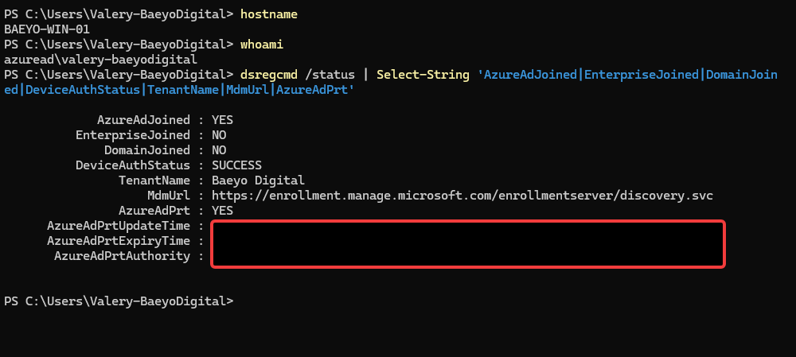

#### 03-02 — Access work or school and MDM synchronization

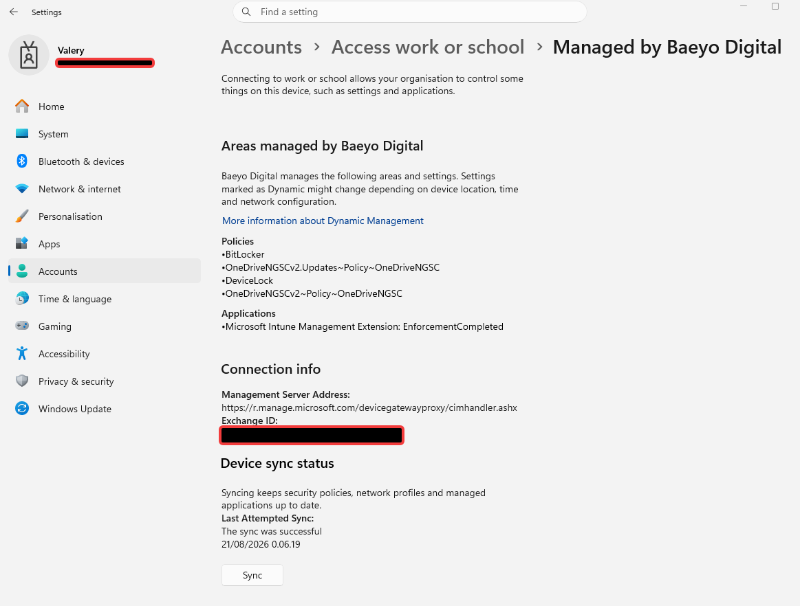

#### 03-03 — Microsoft Entra device properties

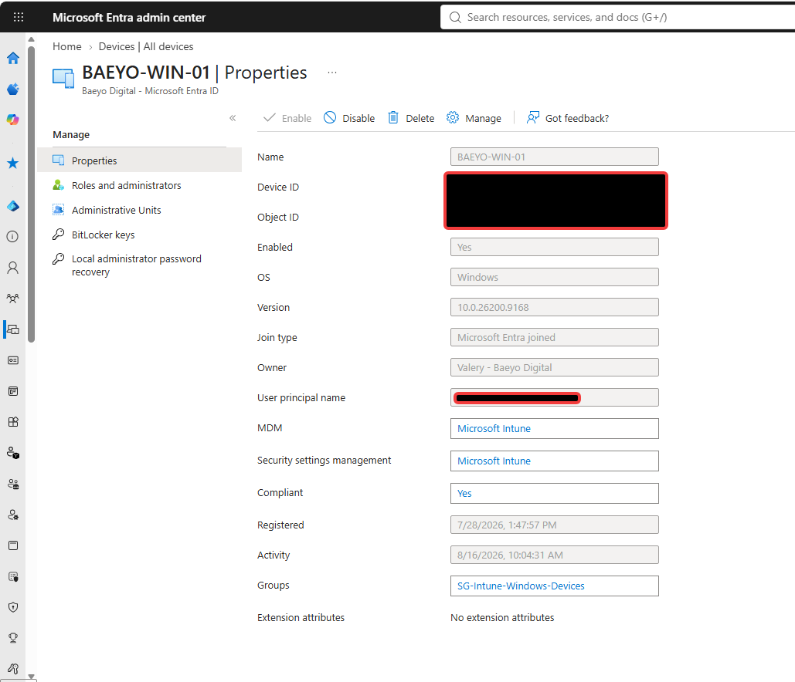

#### 03-04 — Intune device overview

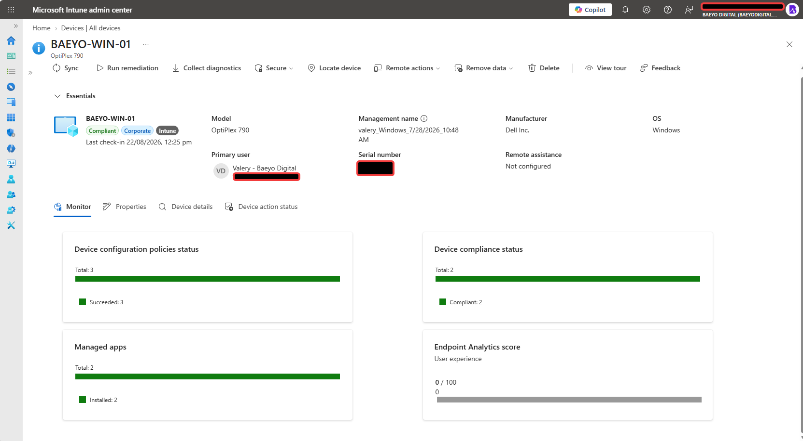

#### 03-05 — Automatic MDM enrollment scope

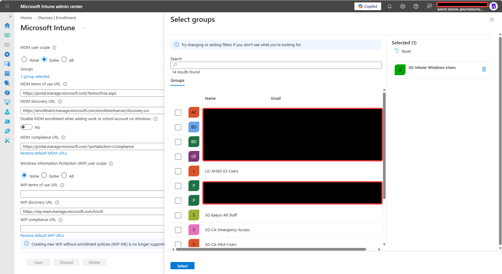

#### 03-06 — Windows enrollment restriction

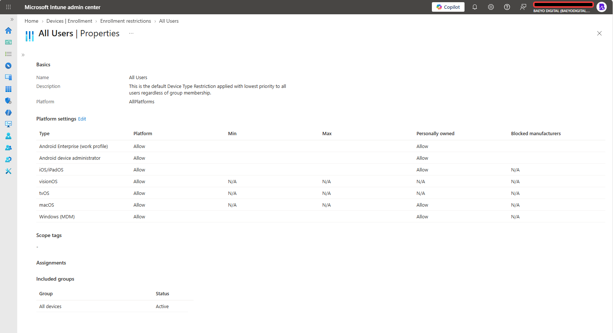

#### 03-07 — Device-limit restriction

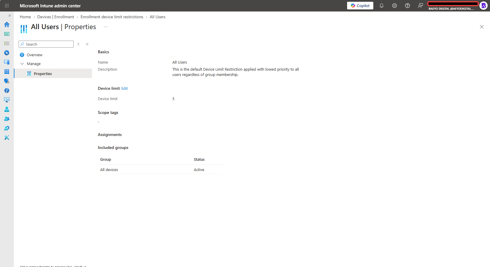

#### 03-08 — Windows compliance-policy settings

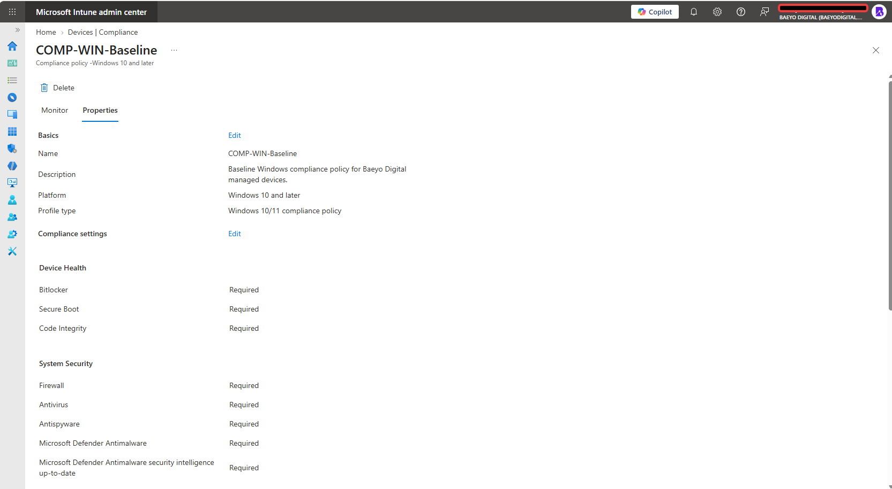

#### 03-09 — Windows compliance-policy assignment

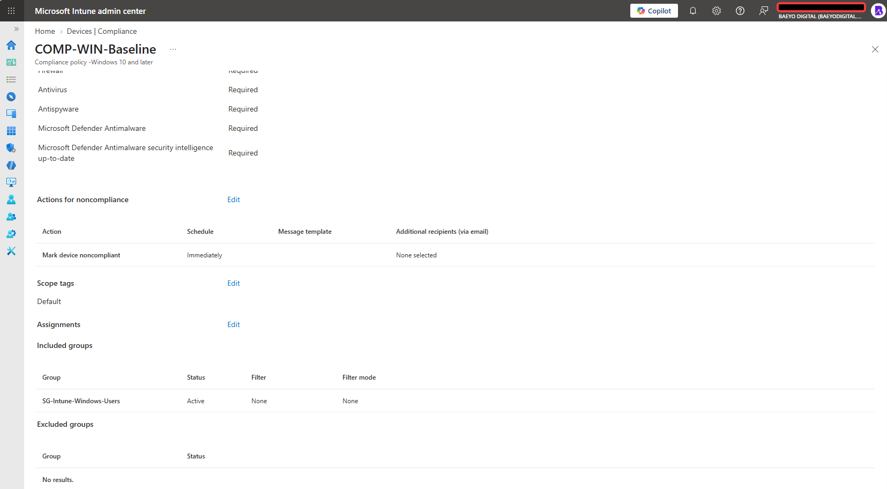

#### 03-10 — Windows configuration-profile inventory

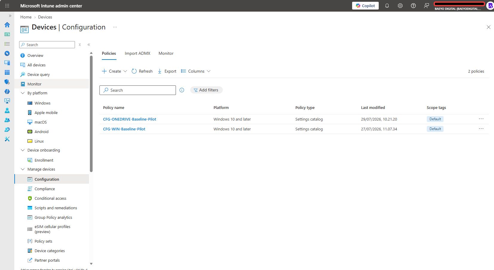

#### 03-11 — Local Administrators membership

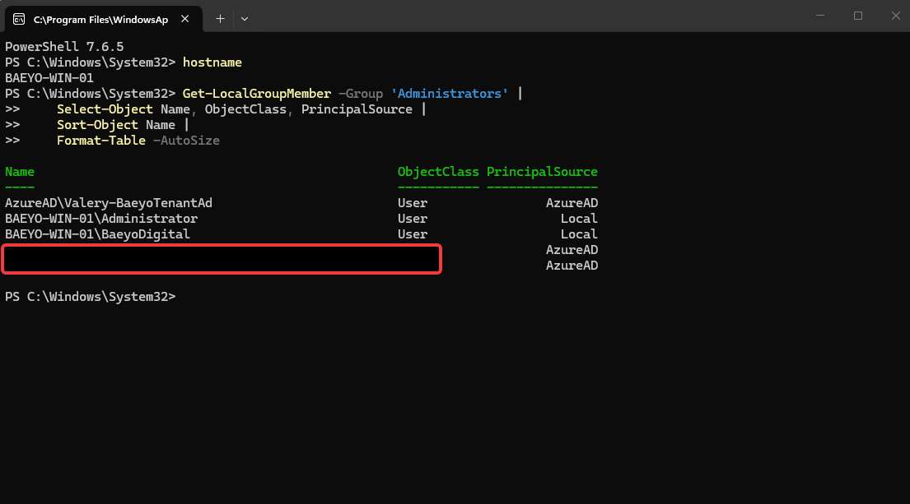

## Security and privacy notes

- Passwords, recovery keys, tokens, private keys, Windows Hello secrets, hardware hashes, and Autopilot import data are not collected.
- Device ID, object ID, Exchange ID, serial number, and unresolved SID values are sanitized because they are unnecessary unique identifiers.
- `daily-user@baeyodigital.example` and `tenant-admin@baeyodigital.example` remain visible because they are established lab identities already documented in Module 01 and are required to demonstrate role separation. They are identifiers, not credentials.
- Unrelated directory search results are removed from the MDM-scope image because they do not support Module 03.
- No device or tenant configuration was changed for retrospective evidence collection.

## Lessons learned

- The account used for the initial Entra join affects the resulting ownership, enrollment, and local-administration context; the intended licensed daily user should be used from the start.
- End-state validation should correlate Windows, Microsoft Entra, and Intune rather than relying on one portal alone.
- A successful device overview can prove several closely related results and reduce repetitive screenshots.
- Current-state evidence must not be described as original implementation or before-state evidence.
- Unresolved local group principals should be investigated before removal; an unexplained SID is a review item, not automatic proof that deletion is safe.

## Final outcome

The original configuration was implemented under Microsoft 365 E3 with Windows 11 Enterprise active. During retrospective documentation, `BAEYO-WIN-01` was running Windows 11 Pro under the Microsoft 365 Business Premium licensing context and remained Microsoft Entra joined, enrolled and actively managed by Microsoft Intune, owned as a corporate device, associated with the intended licensed daily user, compliant with the Windows baseline, and successfully processing assigned configuration. The original wrong-account join was corrected without recreating the error for documentation.

Module 03 is complete, with one non-blocking follow-up recorded: identify the two unresolved Azure AD principals in the local Administrators group during a later privileged-access review before considering any membership change.
