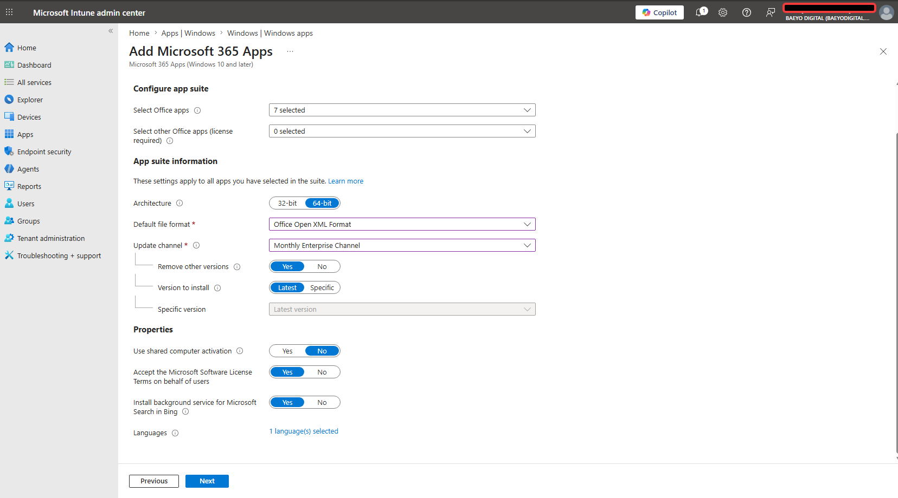
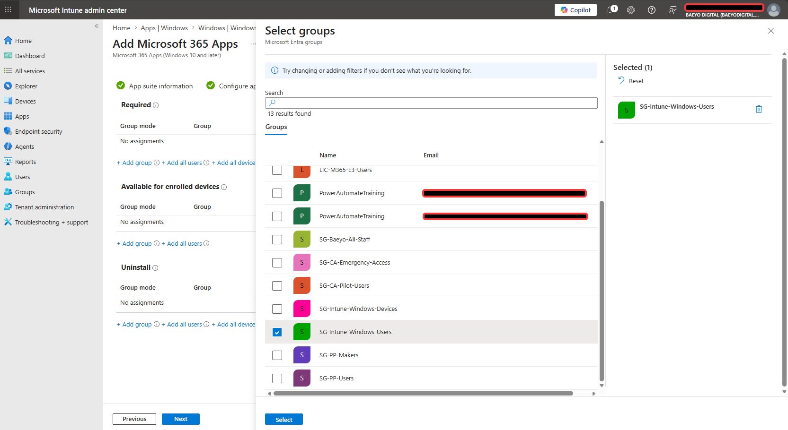
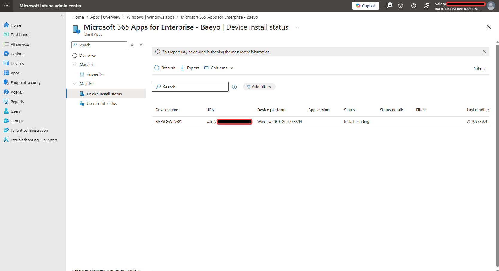
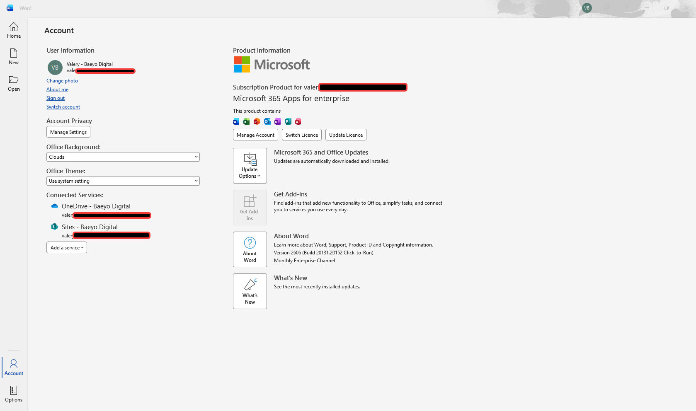
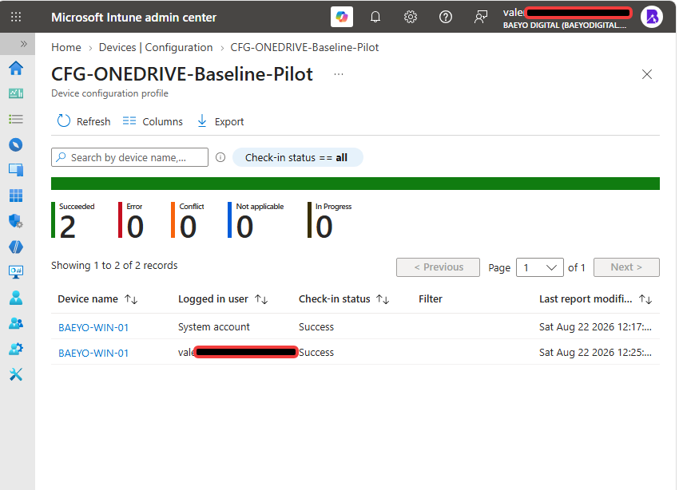
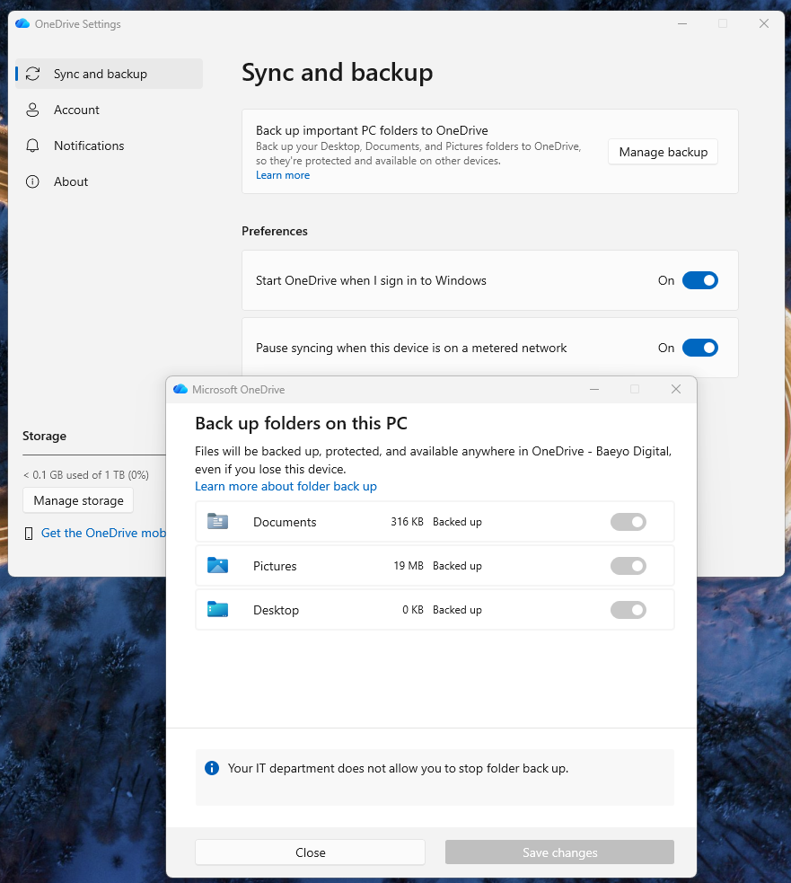
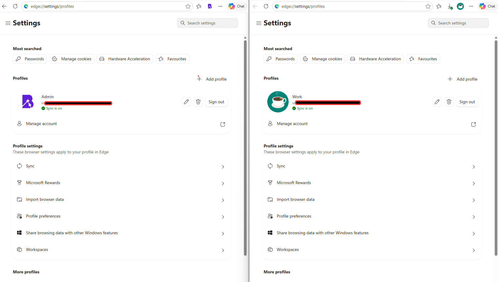
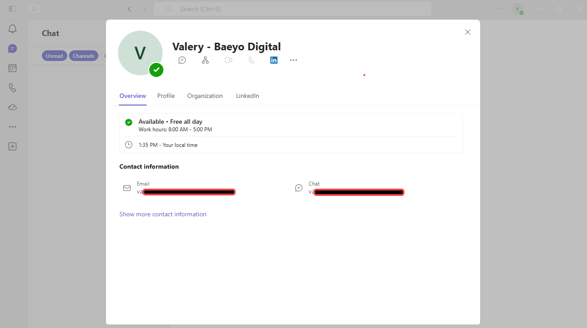

# Module 04 — Microsoft 365 Apps and Workstation

## Module status

| Field | Entry |
|---|---|
| Documentation type | Retrospective module documentation |
| Documentation status | Complete — retrospectively documented and currently validated |
| Original implementation | July 2026; the retained Microsoft 365 Apps evidence was captured on 2026-07-29 |
| Retrospective/current-state validation | 2026-08-24 |
| Implemented by | Valery |
| Tenant | Baeyo Digital |
| Managed workstation | `BAEYO-WIN-01` |
| Primary domain | `baeyodigital.com` |
| Change reference | `CHG-0005` |
| Overall result | Microsoft 365 Apps and the principal daily-user workstation services were implemented and validated |

> **Retrospective documentation notice:** Microsoft 365 Apps, OneDrive, Microsoft Edge and Microsoft Teams were configured before a complete module-specific evidence process was in place. The evidence set therefore combines original implementation screenshots, a retained historical troubleshooting screen and retrospective/current-state validation. Current screenshots are not presented as original implementation or before-state evidence.

## Objective

Document and validate the Microsoft 365 Apps deployment and the daily-user application experience on `BAEYO-WIN-01`. Confirm that the selected desktop-app suite was configured and assigned, that an installed Office application is activated for the licensed daily user, that OneDrive policy and folder protection are operating, that Microsoft Edge separates daily and privileged identities, and that Microsoft Teams is operational under the daily identity.

## Business reason

Baeyo Digital requires a predictable productivity workstation that supports normal business work without routine use of privileged credentials. Centrally assigned Microsoft 365 Apps and OneDrive settings reduce manual configuration, while separate browser profiles reduce the risk of performing ordinary browsing or productivity work in the tenant-administrator context. Current application validation also provides practical evidence of endpoint administration beyond simple device enrollment.

## Scope and dependencies

### Included

- Microsoft 365 Apps suite configuration.
- Deployment assignment to the established Windows user group.
- Original installation-pending observation and later activation outcome.
- Microsoft Word activation for the licensed daily user.
- OneDrive configuration-profile processing.
- OneDrive Known Folder Backup for Desktop, Documents and Pictures.
- Separate synchronized Microsoft Edge profiles for daily and administrative work.
- Microsoft Teams desktop sign-in under the daily identity.
- Current daily-user application experience on `BAEYO-WIN-01`.

### Dependencies already proved elsewhere

- Module 01 is the authoritative record for the Microsoft 365 Business Premium assignment to `daily-user@baeyodigital.example`, the unlicensed privileged identity `tenant-admin@baeyodigital.example`, and the existence of `SG-Intune-Windows-Users`.
- Module 03 is the authoritative record for the Microsoft Entra join, Microsoft Intune enrollment, corporate ownership, primary-user association, compliance, policy processing and synchronization state of `BAEYO-WIN-01`.
- The device name and general administration-workstation baseline remain documented in Module 00.

These dependencies are referenced rather than duplicated in the Module 04 evidence set.

### Excluded or deferred

- Exchange Online mailboxes, mail flow and Outlook mailbox validation.
- SharePoint sites and permissions.
- Teams teams, channels, tabs and collaboration architecture.
- OneDrive and SharePoint library governance beyond the workstation-client outcome.
- Microsoft Lists, Forms and Planner.
- Power Platform governance and automation.
- Administration shortcuts as a separate evidence control; shortcuts are a convenience and do not justify a permanent screenshot.

The excluded collaboration services belong to Module 05. Power Platform work belongs to Modules 06 and 07.

## Environment timeline

The original Microsoft 365 Apps and OneDrive configuration work was completed during July 2026, while the tenant used a Microsoft 365 E3 trial and Windows 11 Enterprise was active through the subscription context. The retained Microsoft 365 Apps screenshots were captured on 29 July 2026.

By the retrospective validation on 24 August 2026, the tenant had moved to Microsoft 365 Business Premium and the workstation was running Windows 11 Pro. The current evidence confirms that the application and workstation outcomes remained operational after that licensing and operating-system transition.

## Intended design

| Component | Intended state |
|---|---|
| Daily productivity identity | `daily-user@baeyodigital.example` |
| Privileged administration identity | `tenant-admin@baeyodigital.example`, separate from daily work |
| Managed device | `BAEYO-WIN-01` |
| Microsoft 365 Apps | Seven selected desktop applications, 64-bit, Monthly Enterprise Channel |
| Deployment targeting | Required assignment to `SG-Intune-Windows-Users` |
| Office activation | Activated through the licensed daily identity |
| OneDrive configuration | Managed through `CFG-ONEDRIVE-Baseline-Pilot` |
| OneDrive client | Connected to Baeyo Digital and protecting the standard Windows folders |
| Edge daily profile | `Work`, synchronized with `daily-user@baeyodigital.example` |
| Edge privileged profile | `Admin`, synchronized with `tenant-admin@baeyodigital.example` |
| Teams desktop | Operational under `daily-user@baeyodigital.example` |

## Implementation record

### 1. Microsoft 365 Apps suite configuration

The Microsoft 365 Apps deployment was configured with seven selected applications, 64-bit architecture and the Monthly Enterprise Channel. The suite was assigned as **Required** to `SG-Intune-Windows-Users`, using the established Intune Windows user group rather than an individual ad hoc assignment.

The original configuration-review screen contained the same principal deployment information as the stronger suite-configuration evidence and was excluded as a duplicate.

### 2. Installation processing and activation outcome

During the original deployment, the application status was observed as pending. The retained screenshot accurately documents that intermediate state, but the available history does not prove the exact cause or correction sequence. No cause is therefore invented in this record.

A later original screenshot confirms Microsoft Word installed and activated for `daily-user@baeyodigital.example`. This provides the application-level outcome for the intended licensed daily user and resolves the documented pending observation at the level supported by the evidence.

Only Word was individually opened and retained as activation evidence. The suite-configuration screen proves the intended seven-app selection; this document does not claim that every selected application was individually launched and tested.

### 3. OneDrive configuration and policy processing

The OneDrive settings-catalog profile `CFG-ONEDRIVE-Baseline-Pilot` was previously configured in Microsoft Intune. An earlier archive screen recorded the silent-sign-in setting being selected during configuration, but that screen alone did not prove completed saving or successful application and was therefore excluded from the minimum permanent evidence set.

Current device-and-user check-in evidence shows:

- Policy: `CFG-ONEDRIVE-Baseline-Pilot`
- Succeeded: 2
- Error: 0
- Conflict: 0
- Not applicable: 0
- In progress: 0
- `BAEYO-WIN-01` system-account check-in: Success
- `BAEYO-WIN-01` daily-user check-in: Success

This proves that the profile processed successfully in both device and daily-user contexts.

### 4. OneDrive Known Folder Backup

The OneDrive desktop client is connected to **OneDrive – Baeyo Digital**. Its current settings show the standard Windows folders **Documents**, **Pictures** and **Desktop** as backed up. The client also states that the organisation does not allow the user to stop folder backup, demonstrating centrally controlled protection rather than a purely optional personal setting.

OneDrive is configured to start when the user signs in to Windows. The permanent evidence excludes file names and recent activity because those details are unnecessary to prove the control.

### 5. Microsoft Edge identity separation

Microsoft Edge uses two separate synchronized work profiles:

| Edge profile | Identity | Purpose | Sync state |
|---|---|---|---|
| `Work` | `daily-user@baeyodigital.example` | Normal productivity and business browsing | On |
| `Admin` | `tenant-admin@baeyodigital.example` | Privileged Microsoft 365 administration | On |

This separation reduces the likelihood of using privileged credentials for normal browsing and makes the active administrative context visually distinct. A separate screenshot of administration shortcuts was deliberately not retained because shortcuts are workflow conveniences rather than meaningful proof of a security or deployment outcome.

### 6. Microsoft Teams daily-user experience

The Microsoft Teams desktop application is installed and operational. Current validation shows the Baeyo Digital profile **Valery – Baeyo Digital** with `daily-user@baeyodigital.example` as the email and chat identity. The screenshot is limited to the account profile and contains no readable chat or channel content.

This confirms the workstation-side Teams application and daily-user sign-in only. Teams collaboration structures remain Module 05 work.

## Historical troubleshooting record

### TRB-04-01 — Microsoft 365 Apps installation remained pending

| Field | Record |
|---|---|
| Symptom | The Microsoft 365 Apps deployment displayed an installation-pending state during the original implementation. |
| Risk | The assigned daily user might not receive an operational desktop productivity suite. |
| Evidence limitation | The retained screenshot proves the pending state but does not prove its exact cause or every corrective action. |
| Recorded outcome | A later original screenshot confirms Microsoft Word installed and activated for `daily-user@baeyodigital.example`. |
| Current status | Resolved at the evidenced application-outcome level. |
| Lesson | Preserve both the deployment state and an application-level activation result; assignment alone does not prove a usable application. |

No OneDrive, Edge or Teams failure was identified from the approved permanent evidence set.

## Definitive outcome inventory

### Historically completed and evidenced

- Seven-application Microsoft 365 Apps suite configuration.
- 64-bit architecture and Monthly Enterprise Channel selection.
- Required deployment assignment to `SG-Intune-Windows-Users`.
- Original installation-pending observation.
- Later Microsoft Word installation and activation for the daily user.

### Completed but missing original implementation evidence

- The exact sequence used to resolve the installation-pending state.
- The completed save/creation sequence for `CFG-ONEDRIVE-Baseline-Pilot`.
- Original implementation screenshots for the final Edge and Teams states.

These gaps are documented honestly and are not reconstructed or mislabeled as original evidence.

### Verifiable from the current device or tenant

- Successful OneDrive profile processing for the system and daily-user contexts.
- Baeyo Digital OneDrive connection and enforced Known Folder Backup.
- Separate synchronized Work and Admin Edge profiles.
- Teams desktop operation under the daily user.
- Continued daily-user productivity access after the move to Business Premium and Windows 11 Pro.

### Not implemented

No missing required Module 04 application or workstation outcome was identified from the approved evidence set.

### No longer applicable or deliberately excluded

- The July configuration-review screenshot is redundant with the stronger suite-configuration screen.
- Earlier OneDrive before/after screens are superseded by stronger policy-processing and client-outcome evidence.
- The OneDrive setting-selection screenshot is progress evidence and is superseded by successful processing and enforced client behavior.
- Administration shortcuts do not warrant permanent evidence.

## Validation results

| Test ID | Test | Expected result | Actual result | Status |
|---|---|---|---|---|
| T04-01 | Review Microsoft 365 Apps suite configuration | Intended applications, architecture and update channel recorded | Seven applications selected; 64-bit; Monthly Enterprise Channel | Pass |
| T04-02 | Review deployment assignment | Required deployment targets the established Windows user group | `SG-Intune-Windows-Users` assigned as Required | Pass |
| T04-03 | Validate Office activation | An installed Office application is activated for the licensed daily user | Word activated for `daily-user@baeyodigital.example` | Pass |
| T04-04 | Validate OneDrive policy processing | Applicable device/user results succeed without errors or conflicts | Two succeeded; zero error, conflict, not applicable or in progress | Pass |
| T04-05 | Validate OneDrive folder protection | Desktop, Documents and Pictures are backed up and centrally controlled | All three folders backed up; user cannot stop folder backup | Pass |
| T04-06 | Validate Edge identity separation | Daily and privileged identities use separate synchronized profiles | `Work` and `Admin` profiles confirmed; sync on for both | Pass |
| T04-07 | Validate Teams desktop identity | Teams is operational under the daily identity | `daily-user@baeyodigital.example` shown in Teams desktop | Pass |

## Evidence register

| ID | Final filename | What it proves | Classification | Sanitization |
|---|---|---|---|---|
| 04-01 | `04-01-m365-apps-suite-configuration.png` | Seven selected apps, 64-bit architecture and Monthly Enterprise Channel | Original implementation evidence | No redaction required; the established Baeyo lab administrator identity may remain visible |
| 04-02 | `04-02-m365-apps-required-group-assignment.png` | Required assignment to `SG-Intune-Windows-Users` | Original implementation evidence | No redaction required; retain the established lab identity and group name |
| 04-03 | `04-03-m365-apps-installation-pending.png` | Original installation-pending state | Historical troubleshooting evidence | Sign-in identity anonymized for the public copy; unique device identifiers redacted if visible |
| 04-04 | `04-04-word-activation-daily-user.png` | Word installed and activated for `daily-user@baeyodigital.example` | Original implementation evidence and historical troubleshooting outcome | Daily-user UPN anonymized for the public copy; product ID redacted if visible |
| 04-05 | `04-05-onedrive-policy-status.png` | Successful OneDrive profile check-in for the device and daily user | Retrospective/current-state validation | No redaction required; the established administrator and daily-user identities may remain visible |
| 04-06 | `04-06-onedrive-known-folder-backup-enforced.png` | Baeyo Digital connection, folder backup and organisational enforcement | Retrospective/current-state validation | No redaction required; optionally crop the outer wallpaper |
| 04-07 | `04-07-edge-work-admin-profile-separation.png` | Separate synchronized daily and privileged Edge profiles | Retrospective/current-state validation | No redaction required |
| 04-08 | `04-08-teams-daily-user-sign-in.png` | Teams desktop operational under the daily identity | Retrospective/current-state validation | No redaction required; no readable collaboration content retained |

## Evidence images

### 04-01 — Microsoft 365 Apps suite configuration

### 04-02 — Microsoft 365 Apps required group assignment

### 04-03 — Microsoft 365 Apps installation pending

### 04-04 — Word activation for the daily user

### 04-05 — OneDrive policy status

### 04-06 — Enforced OneDrive Known Folder Backup

### 04-07 — Edge work and administrator profile separation

### 04-08 — Teams daily-user sign-in

## Security and privacy notes

- Passwords, tokens, recovery codes, private keys, customer content and browser history are not collected.
- The public portfolio uses anonymized UPN placeholders while retaining display names and daily/privileged role separation.
- Sign-in identities were anonymized consistently across the public portfolio on 2026-09-03.
- Product identifiers and unnecessary unique device identifiers are redacted if visible.
- OneDrive file names, recent activity and personal content are not retained.
- Teams chat, channel and message content is not retained.
- Edge browsing history and unrelated profiles are not retained.
- Original and retrospective evidence are classified separately.

## Lessons learned

- A required application assignment proves targeting, not successful installation; retain an application-level activation result.
- Intermediate pending states are useful troubleshooting evidence only when the eventual outcome is also documented.
- OneDrive configuration should be validated at both the management-policy and Windows-client levels.
- Separate browser profiles provide a practical guardrail between normal work and privileged administration.
- Application sign-in should use the licensed daily identity rather than the tenant-administrator identity.
- Minimum evidence is stronger than documenting every available portal tab or convenience feature.

## Final outcome

Microsoft 365 Apps and the principal daily-user workstation experience are operational on `BAEYO-WIN-01`. The intended seven-app, 64-bit Monthly Enterprise Channel deployment was assigned as Required to `SG-Intune-Windows-Users`; Microsoft Word is installed and activated for `daily-user@baeyodigital.example`; `CFG-ONEDRIVE-Baseline-Pilot` processes successfully for the system and daily-user contexts; OneDrive protects Desktop, Documents and Pictures under organisational control; Edge separates synchronized daily and privileged identities; and Teams desktop is operational under the daily user.

The original July work occurred in the Microsoft 365 E3 and Windows 11 Enterprise context. The August validation confirms that the application outcomes remain operational after the transition to Microsoft 365 Business Premium and Windows 11 Pro. No tenant or workstation settings were changed solely to improve the documentation.

## Non-blocking follow-ups

- Validate additional individual Microsoft 365 desktop applications only when a real business or troubleshooting need requires it; do not open every application solely to manufacture screenshots.
- Document Teams, SharePoint, OneDrive-library and Exchange collaboration design in Module 05 without duplicating the Module 04 workstation evidence.
