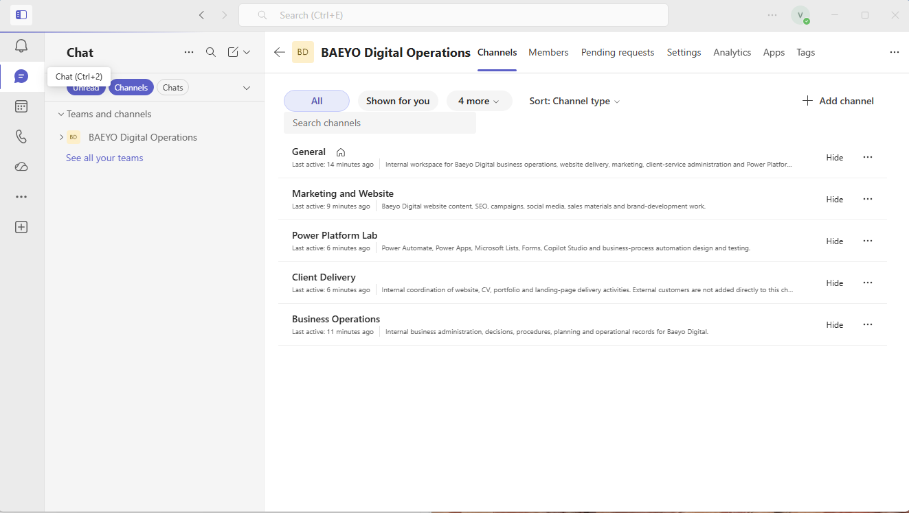
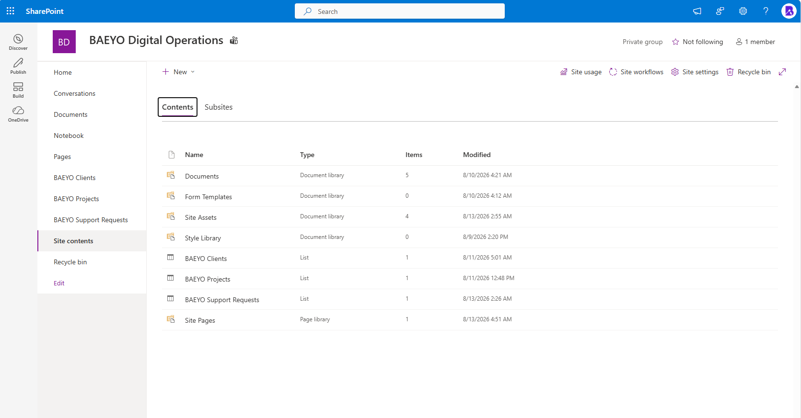
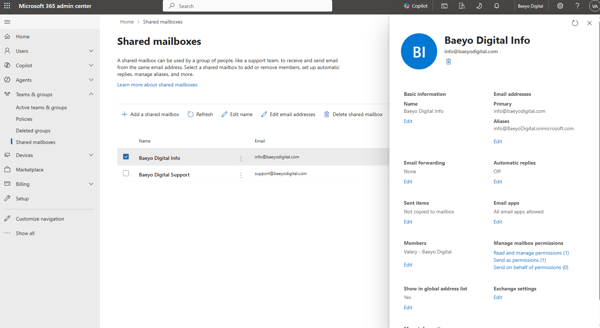
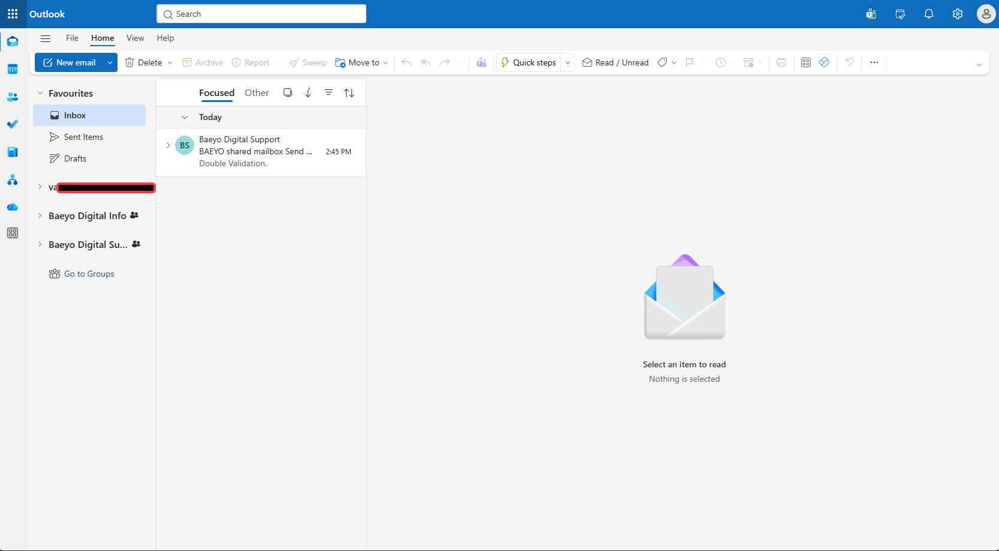
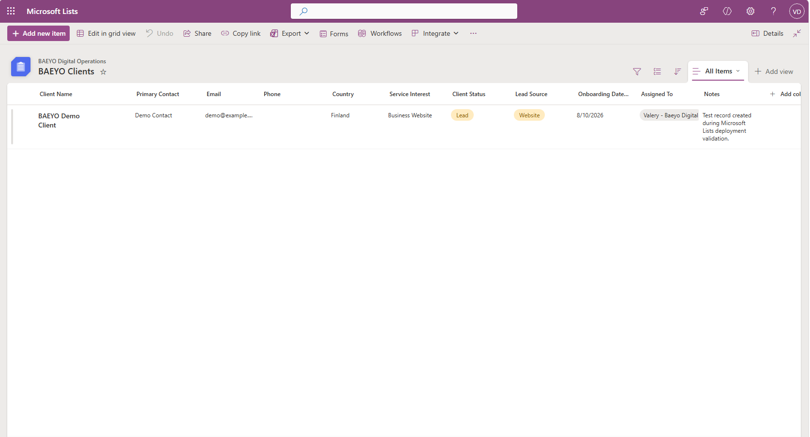
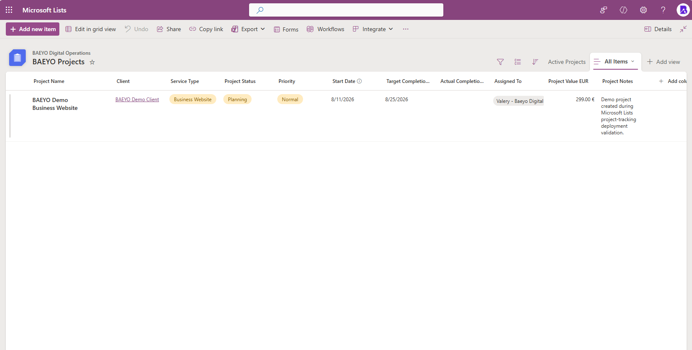
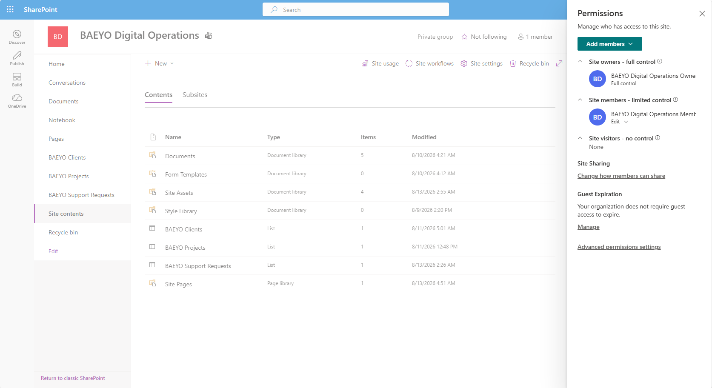
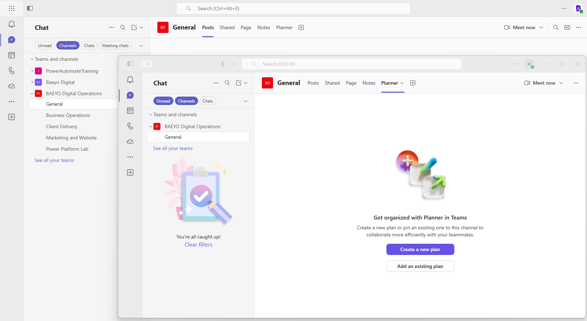
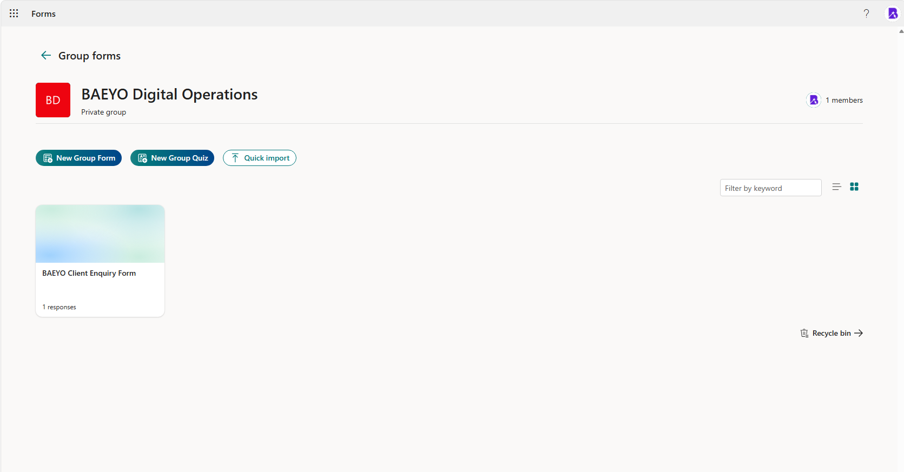

# Module 05 — Exchange, SharePoint, Teams, and OneDrive

## Module status

| Field | Entry |
|---|---|
| Documentation type | Retrospective module documentation |
| Documentation status | Complete — retrospectively documented and currently validated |
| Original implementation | August 2026; retained original evidence was captured on 2026-08-10 and 2026-08-11 |
| Retrospective/current-state validation | 2026-08-25 |
| Implemented by | Valery |
| Tenant | Baeyo Digital |
| Primary domain | `baeyodigital.com` |
| Change reference | `CHG-0006` |
| Overall result | Exchange Online, SharePoint, Teams, Lists, Forms and the Planner channel-tab integration were implemented and validated; OneDrive workstation controls remain proved by Module 04 |

> **Retrospective documentation notice:** The collaboration environment was configured before a complete module-specific evidence process was in place. The approved evidence therefore combines retained original screenshots from 10–11 August 2026 with retrospective/current-state validation from 25 August 2026. Current screenshots are not presented as original implementation or before-state evidence.

## Objective

Document and validate the communication and collaboration design used in the Baeyo Digital tenant. Confirm the shared-mailbox structure and Outlook access, the private SharePoint and Teams workspace, the operational Microsoft Lists data model, the group-owned Microsoft Form, and the availability of Planner as a Teams channel tab. Reference the already validated OneDrive workstation controls from Module 04 without collecting duplicate evidence.

## Business reason

Baeyo Digital needs shared communication addresses that are independent of one employee, a controlled collaboration workspace, and lightweight structured records for clients and projects. Exchange Online shared mailboxes provide role-based business addresses; Teams and SharePoint provide a common private workspace; Microsoft Lists records operational data; Forms provides a group-owned client-enquiry entry point; and Planner availability supports future task coordination without requiring a separate collaboration platform.

This design keeps daily work under `daily-user@baeyodigital.example`, retains `tenant-admin@baeyodigital.example` for privileged administration, and avoids storing passwords, secrets or real customer data in the documentation repository.

## Scope and dependencies

### Included

- Exchange Online shared mailboxes for Info and Support.
- Shared-mailbox visibility and a retained Support test message in Outlook.
- The private `BAEYO Digital Operations` Microsoft 365 group, Team and SharePoint site.
- Five operational Teams channels.
- SharePoint site contents and permission groups.
- `BAEYO Clients`, `BAEYO Projects` and `BAEYO Support Requests` lists.
- The lookup relationship between the demonstration project and demonstration client.
- The group-owned `BAEYO Client Enquiry Form`.
- Planner availability as a tab in the General channel in Teams web and desktop.
- Historical Planner-tab troubleshooting at the level supported by the retained history and current validation.

### Dependencies already proved elsewhere

- Module 01 is the authoritative record for the Baeyo Digital identities, Microsoft 365 Business Premium licensing and Microsoft 365 group dependencies.
- Module 02 is the authoritative record for authentication and Microsoft Entra security controls.
- Module 03 is the authoritative record for Microsoft Entra join, Microsoft Intune management and the compliant managed workstation.
- Module 04 is the authoritative record for Microsoft 365 Apps, enforced OneDrive Known Folder Backup, separate Edge daily/privileged profiles and Teams desktop sign-in under `daily-user@baeyodigital.example`.

These dependencies are referenced rather than duplicated in the Module 05 evidence set.

### Excluded or deferred

- Duplicate identity, licensing, group, authentication, device, Intune, Microsoft 365 Apps, OneDrive workstation, Edge-profile or Teams-sign-in evidence.
- Detailed current delegation validation for the Support shared mailbox; the approved evidence proves its existence and Outlook access but not every current delegation value.
- A Planner plan or task board; the approved current screen shows that no plan is attached to the channel tab.
- Forms response contents and any real customer information.
- Power Automate flows, Power Apps, websites and later-module business automation.
- Private-master-only identity details, which are excluded from this sanitized public portfolio copy.

## Environment timeline

The retained collaboration evidence was captured during the original August 2026 implementation period. On 10 August, the Teams channel structure, SharePoint site and shared mailboxes were recorded. On 11 August, Outlook shared-mailbox access and the Clients and Projects demonstration records were recorded.

On 25 August 2026, the current tenant was reviewed to replace weak archive screens and close genuine evidence gaps. The current validation confirmed the SharePoint content inventory, the full Projects list view, the site permission structure, the Planner tab in Teams web and desktop, and the group-owned client-enquiry form. No production customer data was required for validation.

## Intended design

| Component | Intended state |
|---|---|
| Daily productivity identity | `daily-user@baeyodigital.example` |
| Privileged administration identity | `tenant-admin@baeyodigital.example` |
| Info shared mailbox | `info@baeyodigital.com` |
| Support shared mailbox | `support@baeyodigital.com` |
| Collaboration group and Team | Private `BAEYO Digital Operations` workspace |
| SharePoint | Group-connected private team site with controlled permission groups |
| Document storage | SharePoint Documents library; workstation-side OneDrive controls referenced from Module 04 |
| Operational lists | `BAEYO Clients`, `BAEYO Projects`, `BAEYO Support Requests` |
| List relationship | Projects use a Client lookup to the Clients list |
| Forms | Group-owned `BAEYO Client Enquiry Form` |
| Planner | Available as a General-channel tab; no plan currently attached |

## Implementation record

### 1. Exchange Online shared mailboxes

Two role-based shared mailboxes were configured:

| Display name | Primary address | Purpose |
|---|---|---|
| Baeyo Digital Info | `info@baeyodigital.com` | General business enquiries |
| Baeyo Digital Support | `support@baeyodigital.com` | Support communication |

The retained Exchange administration evidence shows both shared mailboxes. For the selected Info mailbox, the retained screen records one member, one **Read and manage** assignment, one **Send as** assignment and no **Send on behalf** assignment. The mailbox is included in the global address list.

The same screen does not expose every current delegation value for the Support mailbox. This document therefore does not claim that the Support delegation configuration is identical to Info.

### 2. Outlook shared-mailbox access

The retained Outlook evidence shows both Baeyo Digital shared mailboxes available to the daily user. A Support test message is present in the mailbox view, confirming practical access and receipt at the level visible in the screenshot.

The screen does not display complete message headers or prove every inbound and outbound mail-flow direction. It is therefore classified as shared-mailbox access and test-message evidence rather than comprehensive mail-flow testing.

### 3. Teams collaboration structure

The private Team `BAEYO Digital Operations` was configured with five channels:

| Channel | Intended use |
|---|---|
| General | Common team communication and shared collaboration entry point |
| Marketing and Website | Marketing and website coordination |
| Power Platform Lab | Controlled learning and future platform experimentation |
| Client Delivery | Client-service coordination |
| Business Operations | Internal business administration |

The original Teams screenshot shows the complete channel structure and descriptions. It is the authoritative Module 05 evidence for the Team architecture; Module 04 remains authoritative only for the Teams desktop application and daily-user sign-in.

### 4. SharePoint site contents and permissions

The Team is backed by the private `BAEYO Digital Operations` SharePoint site. Current Site contents validation shows the principal collaboration objects:

- Documents document library.
- Form Templates document library.
- Site Assets and Style Library.
- `BAEYO Clients` list.
- `BAEYO Projects` list.
- `BAEYO Support Requests` list.
- Site Pages.

The permission panel records:

- Site Owners — Full control.
- Site Members — Edit / limited control.
- Site Visitors — None.
- Private group status.

This proves a controlled group-based permission structure without requiring a screenshot of every individual group member. The established Baeyo lab identities may remain visible when necessary, but no unrelated guest or customer identity is retained.

### 5. Microsoft Lists operational data model

#### BAEYO Clients

The `BAEYO Clients` list contains a saved placeholder record for `BAEYO Demo Client`. The retained evidence shows operational fields for contact information, country, service type, client status, source, onboarding date, assignment and notes. The record uses demonstration values rather than real customer information.

#### BAEYO Projects

The `BAEYO Projects` list contains the saved project `BAEYO Demo Business Website`. Current validation shows:

- Client lookup: `BAEYO Demo Client`.
- Service type: Business Website.
- Project status: Planning.
- Priority: Normal.
- Start and target-completion dates.
- Assignment to Valery – Baeyo Digital.
- Demonstration project value and project notes.

The Client lookup proves a basic relationship between the Projects and Clients lists. The stronger current full-list view replaces the archived cropped screenshot that omitted the site name, list name and project name.

#### BAEYO Support Requests

Current Site contents validation confirms that `BAEYO Support Requests` exists and contains one item. No separate screenshot was retained because the module does not need to expose or overclaim the request’s contents or schema.

### 6. Microsoft Forms group form

The private `BAEYO Digital Operations` group owns `BAEYO Client Enquiry Form`. Current validation shows one recorded response while keeping the response contents closed. This proves the form’s group ownership and operational use without retaining potentially sensitive submitted information.

The unrelated personal `Vacation Requests` form shown during temporary navigation was excluded from the permanent evidence set.

### 7. Planner tab availability

During the original implementation, Planner did not initially appear as an available Teams channel tab. The Teams app availability/policy configuration was completed and allowed time to propagate.

During current validation, the Planner app was added to the `BAEYO Digital Operations` General channel. The approved screenshot shows the Planner tab present in both Teams web and desktop. The selected tab offers **Create a new plan** and **Add an existing plan**, proving that the integration is available while also proving that no plan is currently attached.

The record separates three facts that should not be conflated:

- The administrative app-availability work was completed.
- The General-channel Planner tab is now present.
- A Planner plan or populated task board has not been implemented.

### 8. OneDrive dependency

Module 04 already proves the workstation-side OneDrive configuration, successful management-policy processing, connection to Baeyo Digital and enforced backup of Desktop, Documents and Pictures. Module 05 therefore does not collect another OneDrive screenshot.

Within Module 05, SharePoint Site contents proves the shared document-library side of the collaboration design. The existing Module 04 evidence remains the authoritative record for the synchronized Windows-client controls.

## Historical troubleshooting record

### TRB-05-01 — Planner was unavailable in the Teams channel-tab search

| Field | Record |
|---|---|
| Symptom | Planner did not initially appear when adding a tab to the `BAEYO Digital Operations` General channel. |
| Risk | The intended Teams task-coordination entry point could not be added. |
| Historical action | Planner app availability/policy configuration was completed and allowed time to propagate. |
| Current validation | The Planner app was added and the tab is visible in both Teams web and desktop. |
| Evidence boundary | The current tab is not mislabeled as an original implementation screenshot, and no attached plan or tasks are claimed. |
| Current status | Resolved for app and tab availability; no Planner plan attached. |
| Lesson | Teams app availability and a channel tab are separate states; both must be checked before concluding that a collaboration feature is ready. |

No Exchange, SharePoint, Lists or Forms failure was identified from the approved permanent evidence set.

## Definitive outcome inventory

### Historically completed and evidenced

- `BAEYO Digital Operations` Team and five-channel structure.
- Exchange Online Info and Support shared mailboxes.
- Info mailbox membership and retained delegation configuration.
- Outlook visibility of both shared mailboxes and the Support test message.
- `BAEYO Clients` saved demonstration record.
- Initial `BAEYO Projects` demonstration data and client lookup.
- Planner app availability/policy remediation.

### Completed but missing strong original implementation evidence

- Full SharePoint content inventory.
- Final SharePoint permission structure.
- A complete uncropped original Projects list view.
- Original end-state evidence for the group-owned client-enquiry form.
- Original end-state evidence for the Planner tab after app-policy propagation.
- Exact current Support-mailbox delegation values.

These gaps are documented honestly. Current screenshots close the necessary outcome gaps without being mislabeled as original implementation evidence. Exact Support delegation values are not required for the minimum permanent set and are not overclaimed.

### Verifiable from the current tenant

- SharePoint libraries, lists and item counts.
- Private SharePoint permission groups and access levels.
- Complete Projects list view and Client lookup relationship.
- Group-owned `BAEYO Client Enquiry Form` and response count.
- Planner tab availability in Teams web and desktop.
- Continued existence of the collaboration environment after the move to Microsoft 365 Business Premium.

### Not implemented

- No Planner plan or populated task board is attached to the General-channel tab.

This is recorded as the actual current state and is not treated as a blocker to documenting the collaboration services that are implemented.

### No longer applicable or deliberately excluded

- The archived empty SharePoint General-library screenshot is superseded by the stronger current Site contents evidence.
- The archived cropped Projects screenshot is superseded by the current full-list view.
- Pre-save, configuration-progress and duplicate screenshots are excluded.
- Temporary navigation screenshots taken before the Planner tab was added and before the group form was opened are excluded.
- Duplicate Module 00–04 evidence is excluded and referenced instead.

## Validation results

| Test ID | Test | Expected result | Actual result | Status |
|---|---|---|---|---|
| T05-01 | Review shared-mailbox configuration | Info and Support shared mailboxes exist; retained Info access assignments are recorded | Both mailboxes shown; Info has one member, one Read/manage and one Send-as assignment | Pass |
| T05-02 | Validate Outlook shared-mailbox access | Shared mailboxes are available to the daily user and a retained test message is visible | Info and Support are present; Support test message shown | Pass |
| T05-03 | Validate Teams channel structure | The private operational Team contains the intended five channels | General, Marketing and Website, Power Platform Lab, Client Delivery and Business Operations shown | Pass |
| T05-04 | Validate SharePoint content inventory | Principal libraries and operational lists are present | Documents, BAEYO Clients, BAEYO Projects and BAEYO Support Requests shown with supporting site content | Pass |
| T05-05 | Validate SharePoint permissions | Owners, Members and Visitors follow the intended private-site access model | Owners have Full control; Members have Edit/limited control; Visitors have none | Pass |
| T05-06 | Validate Clients list | Saved demonstration client record and operational columns are visible | `BAEYO Demo Client` and its demonstration fields shown | Pass |
| T05-07 | Validate Projects relationship | Saved project links to the demonstration client and exposes key project fields | `BAEYO Demo Business Website` links to `BAEYO Demo Client`; key fields shown | Pass |
| T05-08 | Validate Planner tab | Planner is available in the General channel without claiming an attached plan | Planner tab visible in Teams web and desktop; create/add-plan choices shown | Pass |
| T05-09 | Validate group-owned form | Client-enquiry form exists under the operational group without exposing response data | `BAEYO Client Enquiry Form` shown under the private group with one response | Pass |
| T05-10 | Confirm OneDrive dependency coverage | Module 04 remains the authoritative workstation-side OneDrive record | Module 04 documents successful policy processing and enforced folder backup | Pass — referenced dependency |

## Evidence register

| ID | Final filename | What it proves | Classification | Sanitization |
|---|---|---|---|---|
| 05-01 | `05-01-teams-operations-channel-structure.png` | `BAEYO Digital Operations` Team and five configured channels with descriptions | Original implementation evidence | No redaction required; established Baeyo lab names may remain visible |
| 05-02 | `05-02-sharepoint-site-contents-current-state.png` | Current SharePoint library and list inventory | Retrospective/current-state validation | No redaction required; exclude unrelated guest or customer information if later recaptured |
| 05-03 | `05-03-shared-mailboxes-info-permissions.png` | Both shared mailboxes and the retained Info membership/delegation configuration | Original implementation evidence | No redaction required; established Baeyo addresses and lab identity may remain visible |
| 05-04 | `05-04-outlook-shared-mailbox-access-test-message.png` | Outlook shared-mailbox availability and retained Support test message | Original implementation evidence | No redaction required; no unrelated message contents retained |
| 05-05 | `05-05-baeyo-clients-demo-record.png` | Clients list structure and saved placeholder client record | Original implementation evidence | Demonstration data only; no redaction required |
| 05-06 | `05-06-baeyo-projects-linked-demo-record.png` | Full Projects list view, saved project and Client lookup relationship | Retrospective/current-state validation | Demonstration data and established lab identity may remain visible |
| 05-07 | `05-07-sharepoint-site-permissions-current-state.png` | Private-site Owners, Members and Visitors permission structure | Retrospective/current-state validation | Sign-in identities anonymized if displayed; role and permission structure retained |
| 05-08 | `05-08-teams-planner-tab-web-and-desktop.png` | Planner tab available in the General channel in Teams web and desktop; no plan attached | Retrospective/current-state validation and troubleshooting outcome | No redaction required; no chat or message content retained |
| 05-09 | `05-09-baeyo-client-enquiry-group-form.png` | Group-owned client-enquiry form and response count without response contents | Retrospective/current-state validation | No redaction required; response contents remain closed |

## Evidence images

### 05-01 — Teams operations channel structure

### 05-02 — SharePoint Site contents current state

### 05-03 — Shared mailboxes and Info permissions

### 05-04 — Outlook shared-mailbox access and test message

### 05-05 — BAEYO Clients demonstration record

### 05-06 — BAEYO Projects linked demonstration record

### 05-07 — SharePoint Site permissions current state

### 05-08 — Teams Planner tab in web and desktop

### 05-09 — BAEYO client-enquiry group form

## Security and privacy notes

- Passwords, tokens, recovery codes, private keys and tenant secrets are not collected.
- Real customer records, Forms response contents and unrelated Outlook messages are not retained.
- The established lab identities `daily-user@baeyodigital.example` and `tenant-admin@baeyodigital.example` may remain visible because they prove the lab design and are identifiers, not credentials.
- The role-based addresses `info@baeyodigital.com` and `support@baeyodigital.com` may remain visible because they are required to demonstrate the Exchange design.
- Demonstration client and project records use safe placeholder data.
- Current validation evidence is classified separately from original implementation evidence.
- Sign-in identities are anonymized consistently in this public portfolio copy; the Info and Support shared-mailbox names remain visible.

## Lessons learned

- Shared-mailbox existence, delegation and practical Outlook access are different outcomes and should not be treated as interchangeable evidence.
- A SharePoint team site should be validated through both its content inventory and its permission model.
- Microsoft Lists lookup columns provide a simple relational structure without requiring a separate database.
- Forms owned by the operational group are more appropriate for continuity than a form visible only under one person’s account.
- Teams app availability, channel-tab presence and an attached Planner plan are three separate states.
- Current validation can replace weak archive screenshots, but it must not be mislabeled as original implementation evidence.
- Referencing strong evidence from an earlier locked module is better than collecting duplicate screenshots.

## Final outcome

Baeyo Digital has a controlled Microsoft 365 communication and collaboration structure. Exchange Online provides the Info and Support shared mailboxes; Outlook shows practical shared-mailbox access; the private `BAEYO Digital Operations` workspace provides Teams channels and a SharePoint site; Microsoft Lists stores demonstration client, project and support-request records; the Projects list links to the Clients list; and the group owns the `BAEYO Client Enquiry Form`.

Planner is available as a General-channel tab in both Teams web and desktop. No plan is currently attached, and no populated task board is claimed. OneDrive workstation policy processing, connection and enforced folder backup remain authoritatively documented in Module 04 and are not duplicated here.

The evidence set accurately separates original implementation evidence, current-state validation and the Planner troubleshooting outcome. No repository content, tenant setting or customer data was changed solely to manufacture stronger historical evidence.

## Non-blocking follow-ups

- Revalidate the Support shared-mailbox delegation values only when a real access change or troubleshooting need requires it.
- Create or attach a Planner plan only when Baeyo Digital has an operational task-management requirement; do not create one solely for documentation evidence.
- Review Forms response access only when an operational owner needs to process enquiries; do not expose response contents in the repository.
