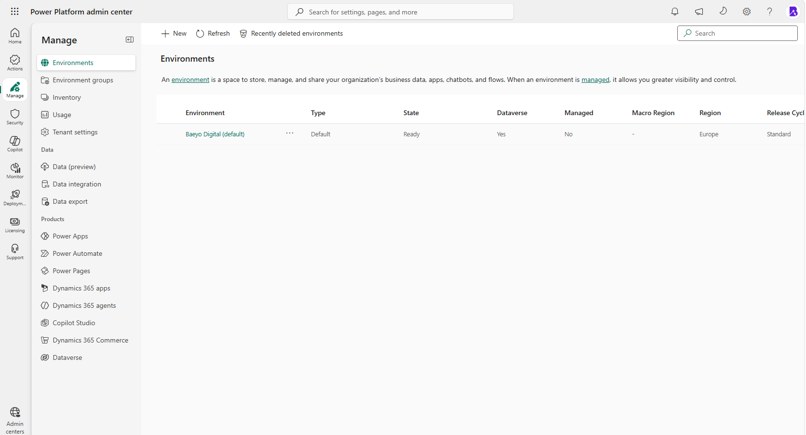
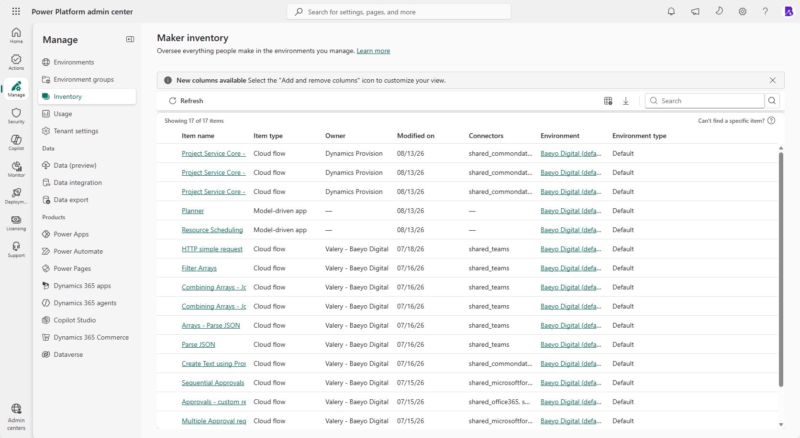
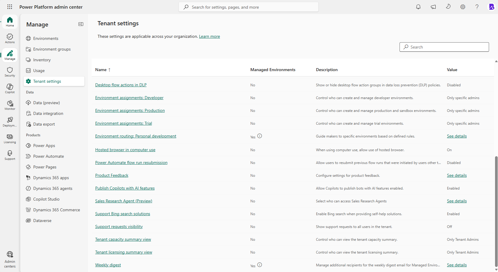
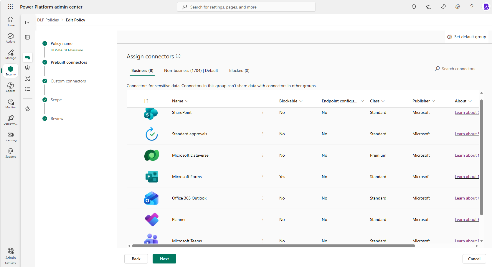
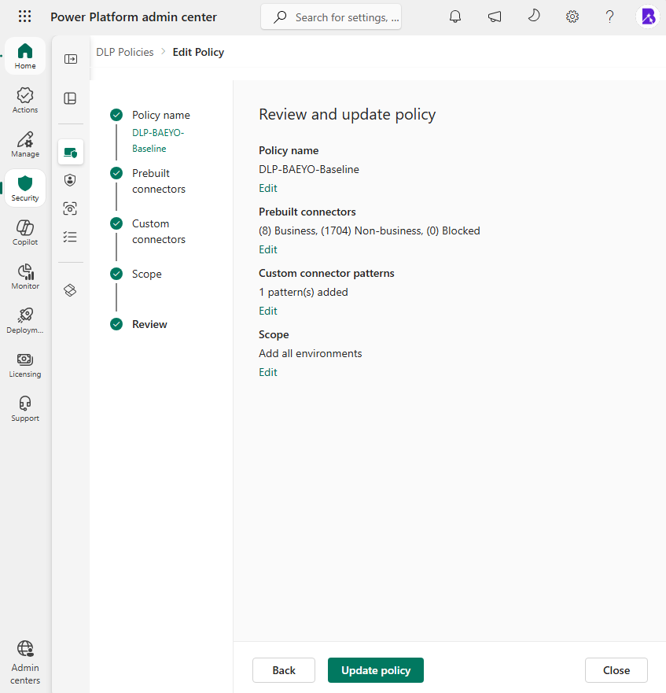
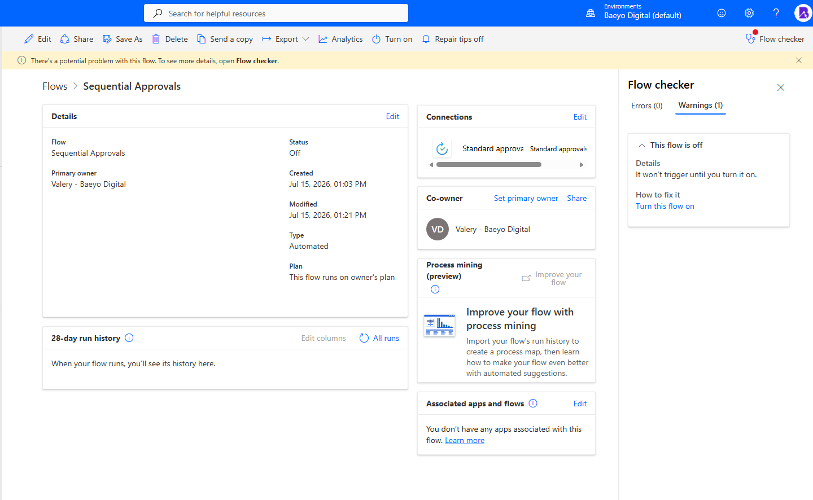

# Module 06 — Power Platform Governance

## Module status

| Field | Entry |
|---|---|
| Documentation type | Real-time implementation and validation |
| Documentation status | Complete — implemented, documented and validated |
| Implementation and validation date | 2026-08-26 |
| Implemented by | Valery |
| Tenant | Baeyo Digital |
| Power Platform environment | `Baeyo Digital (default)` |
| Subscription | Microsoft 365 Business Premium |
| Change reference | `CHG-0007` |
| Overall result | Power Platform resources were inventoried, environment creation was restricted, a tenant-wide data policy was implemented, governance standards were defined, and policy behaviour was validated against existing flows |

## Objective

Establish a practical Power Platform governance baseline before Baeyo Digital begins implementing operational automations in Module 07.

The module inventories the actual tenant state, controls unnecessary environment creation, establishes an approved connector boundary, blocks unapproved custom connectors, defines operational standards for cloud flows, and validates the policy against existing learning resources.

## Business reason

Baeyo Digital intends to use Power Automate for internal enquiry handling and other Microsoft 365 productivity processes. Without an initial governance baseline, makers could create unnecessary environments, combine organisational services with unreviewed connectors, overshare flows, or create automations without clear ownership and recovery procedures.

The implemented baseline balances protection with learning and small-business practicality. Approved Microsoft 365 connectors can work together, Trello remains available for controlled synthetic-data training, new connectors are separated until reviewed, and custom connectors are blocked unless a future requirement justifies an exception.

## Scope and dependencies

### Included

- Power Platform environment inventory.
- Existing app, cloud-flow, agent and connector-dependency inventory.
- Current administrator and maker access confirmation.
- Microsoft 365 Business Premium Power Automate licensing boundary.
- Environment-creation restrictions.
- Definition of the Default environment’s approved purpose.
- Review of broad sharing behaviour.
- Tenant-wide Power Platform data policy.
- Business, Non-business and custom-connector classification.
- Flow naming, ownership, sharing, data-handling, testing, review and recovery standards.
- Validation against existing Power Automate learning flows.
- Documentation of one intentionally restricted Premium learning flow.

### Dependencies already proved elsewhere

- Module 01 is the authoritative record for `daily-user@baeyodigital.example`, `tenant-admin@baeyodigital.example` and Microsoft 365 Business Premium licensing.
- Module 02 is the authoritative record for Microsoft Entra authentication and security controls.
- Module 03 is the authoritative record for the managed Windows device.
- Module 05 is the authoritative record for the Forms, SharePoint, Teams, Planner and Microsoft Lists resources that future Baeyo Digital automations may use.

These dependencies are referenced rather than duplicated.

### Excluded or deferred

- A separate Developer, Sandbox or Production environment.
- Managed Environments.
- Power Platform trials.
- Power Automate Premium licensing.
- AI Builder.
- Copilot Studio.
- Custom connectors.
- A Dataverse solution, custom publisher, environment variables or connection references created solely for portfolio appearance.
- Advanced connector policies and preview controls.
- Connector endpoint filtering preview.
- Module 07 business automations.
- Power Apps, websites, VPS, Azure and wider CRM expansion.
- Private-master-only identity details, which are excluded from this sanitized public portfolio copy.

## Initial environment inventory

One Power Platform environment existed:

| Property | Actual state |
|---|---|
| Name | `Baeyo Digital (default)` |
| Type | Default |
| State | Ready |
| Region | Europe |
| Dataverse | Yes |
| Managed Environment | No |
| Release cycle | Standard |

No `BAEYO-DEV`, separate Production environment or Managed Environment existed.

The original Module 06 placeholder described a future `BAEYO-DEV` environment, a core solution, publisher and environment variables. Those items were aspirational rather than implemented requirements and were not created merely to match the placeholder.

## Resource and connector inventory

The Power Platform inventory contained 17 resources:

| Resource type | Count | Recorded state |
|---|---:|---|
| Cloud flows | 15 | Three Microsoft/Dynamics-provisioned flows, one activated user learning flow and eleven deactivated learning flows |
| Model-driven apps | 2 | Microsoft-provisioned Planner and Resource Scheduling apps |
| Agents | 0 | No agent resource appeared in the inventory |

The three system flows were owned by Dynamics Provision and used Microsoft Dataverse.

The twelve learning flows consisted of eleven flows owned by Valery and one retained flow associated with the Baeyo emergency-access identity. Before the data policy was applied, `HTTP simple request` was activated and the other eleven learning flows were deactivated.

The temporary inventory export identified dependencies on:

- Microsoft Dataverse.
- Microsoft Teams.
- Microsoft Forms.
- SharePoint.
- Standard approvals.
- Office 365 Outlook.
- Trello.

Flow-level validation later revealed that `HTTP simple request` also used the built-in **When an HTTP request is received** trigger. That trigger was not exposed in the connector column of the inventory export.

The export was used only as a temporary discovery aid. It is not part of the permanent evidence set and will not be committed.

## Administrator, maker and connection access

`tenant-admin@baeyodigital.example` successfully accessed the Power Platform admin center, changed tenant-level environment settings and created the tenant-wide data policy. This demonstrates the required administrative access.

`daily-user@baeyodigital.example` owns the retained learning flows and their operational connections, demonstrating maker access in the Default environment.

Flow-level checks showed an existing Microsoft Teams connection in a healthy state and no connection-related error on the approved standard-connector validation flow. Connection credentials, tokens and secrets were never viewed or exported.

## Licensing boundary

The licensed operational account uses Microsoft 365 Business Premium. Its included Power Automate rights support cloud flows using standard connectors.

No standalone Power Automate Premium licence or trial was enabled. The module does not claim entitlement to Premium connectors, AI Builder, custom connectors, unattended desktop automation or Managed Environment capabilities.

Classifying a connector as Business in a data policy controls which connectors may be combined; it does not purchase, enable or assign a licence.

## Implemented governance controls

### 1. Environment-creation restrictions

The following tenant settings were changed from **Everyone** to **Only specific admins**:

| Tenant setting | Final value |
|---|---|
| Environment assignments: Developer | Only specific admins |
| Environment assignments: Production and sandbox | Only specific admins |
| Environment assignments: Trial | Only specific admins |

These controls prevent ordinary makers from creating unnecessary environments while leaving the existing Default environment and its resources unchanged.

### 2. Approved environment purpose

The approved purpose of `Baeyo Digital (default)` is:

> Governed environment for Baeyo Digital internal Microsoft 365 productivity, approved standard-connector Power Automate cloud flows and controlled learning. Synthetic data is required for training and approved external connectors; Premium and custom connectors require separate licensing and governance review.

The Power Platform admin center displayed the Purpose field as read-only for the Default environment. No environment property was changed and no replacement environment was created to work around the limitation. The purpose is therefore defined as an administrative standard in this module.

### 3. Broad sharing

The tenant’s default protection against broad **Share with Everyone** behaviour was retained. No Managed Environment was enabled solely to add sharing controls, and no inventoried resource was identified as deliberately shared with Everyone.

Flow-sharing standards are defined separately below and require least-privilege sharing.

### 4. Baseline data policy

A tenant-level data policy was created:

| Property | Final state |
|---|---|
| Policy name | `DLP-BAEYO-Baseline` |
| Scope | All environments |
| Default group for new prebuilt connectors | Non-business |
| Business connectors | 8 |
| Blocked prebuilt connectors | 0 |
| Custom-connector wildcard | `*` — Blocked |

Applying the policy to all environments protects the existing Default environment and automatically includes any future administrator-created environment.

### 5. Business connector group

The following eight approved connectors were placed in the Business group:

1. Microsoft Forms.
2. SharePoint.
3. Office 365 Outlook.
4. Microsoft Teams.
5. Planner.
6. Standard approvals.
7. Microsoft Dataverse.
8. Trello.

Forms, SharePoint, Outlook, Teams, Planner and Standard approvals support the expected Baeyo Digital enquiry and productivity scenarios.

Microsoft Dataverse was classified with the Business connectors because Microsoft-provisioned resources already depend on it. This classification does not create a new Dataverse dependency or grant Premium rights for user-created flows.

Trello was approved because an existing learning flow uses Trello with Outlook and approvals, and Valery expects to continue using it for flow practice. Trello is not approved automatically for real customer or sensitive business data. Its current approved use is limited by the documented data-handling standard.

### 6. Non-business connector group

All other prebuilt connectors remained Non-business. At implementation time, the portal displayed 1,704 connectors in this group.

Non-business is also the default classification for future prebuilt connectors. New connectors therefore remain separated from the approved Business group until their purpose, licence class, data destination and security implications are reviewed.

External connectors are not prohibited merely because they are external or free. They may be approved later when there is a genuine use case and an appropriate data-handling decision.

### 7. Custom connectors

The tenant-wide custom-connector pattern was changed from:

`* — Ignore`

to:

`* — Blocked`

The previous Ignore state could have allowed unclassified custom connectors to work with both Business and Non-business connectors. Blocking the wildcard prevents unapproved custom connectors while allowing a future administrator to add a specific reviewed exception if required.

This control does not block certified prebuilt external connectors such as Trello.

## Flow governance standards

### Naming

New Baeyo Digital operational flows will use:

`BAEYO - [Process] - [Purpose]`

Example:

`BAEYO - Enquiry - Client Intake`

Version numbers will not be added to the live flow name. Change history and exported recovery packages will record significant revisions.

### Ownership

- `daily-user@baeyodigital.example` is the current licensed operational flow owner.
- `tenant-admin@baeyodigital.example` is reserved for administration and governance rather than routine flow creation.
- Co-owner access will be assigned only when another person or appropriately licensed identity has a genuine editing or continuity requirement.
- Business-critical flows must have their owner, connections and dependencies documented.
- An ownership review is required before disabling or removing an account that owns flows or connections.

### Sharing

- Flows must not be shared with Everyone.
- Co-owner access is limited to identities that must edit or administer the flow.
- Run-only access is preferred when a user needs to execute an instant flow but does not need editing rights.
- Group-based access is preferred over repeated individual assignments when an operational team is later introduced.
- Sharing is reviewed after a material change and during the quarterly governance review.

### Data handling

- Real Baeyo Digital business data may use only connectors approved for the relevant data boundary.
- Training flows must use synthetic or demonstration data.
- Trello is currently approved for training with synthetic data; real customer or sensitive data requires a separate review.
- Passwords, access tokens, API keys, recovery codes and secrets must not be placed in flow names, descriptions, screenshots, documentation or test data.
- A new connector requires review of its purpose, licence class, publisher, authentication method, data destination and DLP classification before use.
- Moving a connector into Business does not itself prove that the service is secure, licensed or suitable for every type of data.

### Testing

- New flows should remain off while incomplete where the design allows.
- Synthetic records must be used during testing.
- Both the expected path and at least one failure or exception path must be tested.
- Connections and permissions must be checked before enabling the flow.
- Run history must be reviewed after testing.
- A flow should be enabled only after its trigger, actions, outputs and failure behaviour produce the intended result.

### Review and monitoring

Active operational flows will be reviewed every 90 days and after material changes.

The review covers:

- Current business purpose.
- Owner and co-owners.
- Run-only users and sharing.
- Connector and connection dependencies.
- Recent failures and run history.
- DLP compliance.
- Unused or duplicate flows.
- Recovery-package currency.
- Continued licensing suitability.

The 90-day interval is a Baeyo Digital operational standard rather than a Microsoft-mandated period.

### Recovery and change handling

- Important non-solution flows should be exported as `.zip` packages after approved material changes where the export feature is supported.
- Export packages are recovery and migration aids, not complete environment backups or mature application-lifecycle management.
- Flow dependencies and required connections must be documented because imported flows can require connection reauthorisation.
- Credentials and secrets must not be stored in the repository.
- If a change causes failure, disable the affected flow, review the run history, correct the configuration, retest with synthetic data and restore the last approved version when necessary.
- Solutions and formal multi-environment application-lifecycle management will be reconsidered only when the business requirement and licensing justify them.

## Policy validation and troubleshooting

### TRB-06-01 — Default environment Purpose field was unavailable

| Field | Record |
|---|---|
| Intended action | Record the approved operational purpose in the environment details |
| Observed state | The Purpose field was read-only for `Baeyo Digital (default)` |
| Decision | Do not rename the environment, change unrelated properties or create another environment as a workaround |
| Resolution | Define the approved purpose in the Module 06 governance standard |
| Status | Accepted platform limitation |

### TRB-06-02 — Existing HTTP learning flow was suspended

After policy enforcement, `HTTP simple request` displayed:

- Status: Suspended.
- Policy warning: `DLP-BAEYO-Baseline` restricted the combination of Microsoft Teams with HTTP.
- Run history: The flow had never run.

The inventory export had exposed Microsoft Teams but not the built-in HTTP request trigger. Flow-level validation therefore identified a dependency that the broad inventory did not reveal.

The **When an HTTP request is received** trigger is Premium. Microsoft 365 Business Premium does not provide the standalone Premium entitlement required for this flow.

HTTP was not moved into the Business group merely to remove the warning because:

- The trigger is outside the current licensing boundary.
- The flow was an unused learning resource rather than an operational Baeyo process.
- HTTP can communicate with external endpoints and requires a deliberate security review.
- Business classification would not grant the missing licence.

The flow definition was retained for possible future licensed study, but the flow remains intentionally suspended. No active business process or customer data was affected.

### Approved standard-connector validation

`Sequential Approvals` uses Microsoft Forms, SharePoint, Standard approvals and Office 365 Outlook, all of which are approved Business connectors.

Its Flow Checker showed:

- Errors: 0.
- Warnings: 1.
- Warning reason: The flow was already turned off.
- DLP-policy violation: None.

The flow was not turned on because Module 06 validates governance compatibility rather than reactivating old course exercises or implementing Module 07 automation.

## Validation results

| Test ID | Test | Expected result | Actual result | Status |
|---|---|---|---|---|
| T06-01 | Inventory environments | Actual environment type, region and governance state are recorded | One Ready Default environment in Europe; Dataverse present; Managed Environment disabled | Pass |
| T06-02 | Inventory resources | Existing apps, flows, agents and connector dependencies are understood | 15 cloud flows, two model-driven apps, no agents and existing connector dependencies recorded | Pass |
| T06-03 | Restrict environment creation | Ordinary makers cannot create unnecessary Developer, Production/Sandbox or Trial environments | All three creation settings changed to Only specific admins | Pass |
| T06-04 | Define environment purpose | Approved use of the environment is explicit | Purpose documented as a governance standard; portal field was read-only | Pass — documented limitation |
| T06-05 | Create baseline data policy | Approved connectors share one Business boundary and future connectors default cautiously | Eight Business connectors; remaining and future prebuilt connectors Non-business | Pass |
| T06-06 | Govern custom connectors | Unapproved custom connectors are not implicitly usable | Wildcard `*` changed from Ignore to Blocked | Pass |
| T06-07 | Apply policy scope | Existing and future environments are covered | Policy scoped to all environments | Pass |
| T06-08 | Validate approved connector combination | Existing standard-connector flow has no DLP violation | `Sequential Approvals` shows zero errors and only the existing Off warning | Pass |
| T06-09 | Validate restricted dependency | Unapproved or unlicensed connector combinations are identified | HTTP learning flow suspended because HTTP and Teams were separated | Pass — intentional restriction |
| T06-10 | Confirm licensing boundary | No unsupported Premium entitlement is claimed or enabled | Business Premium standard-connector scope documented; no trial or Premium licence enabled | Pass |

## Definitive outcome inventory

### Implemented and evidenced

- Actual Default environment inventory.
- Existing Power Platform resource inventory.
- Environment-creation restrictions for Developer, Production/Sandbox and Trial environments.
- Tenant-wide `DLP-BAEYO-Baseline` policy.
- Eight approved Business connectors.
- Non-business default classification for future prebuilt connectors.
- Blocked wildcard for custom connectors.
- Policy scope covering all environments.
- Approved standard-connector flow validation.

### Implemented and documented without separate evidence

- Environment-purpose statement.
- Current licensing boundary.
- Administrator and maker access.
- Default broad-sharing protection.
- Naming, ownership, sharing, data-handling, testing, review and recovery standards.
- Accepted treatment of the old HTTP learning flow.

### Known limitations

- The Default environment Purpose field was read-only.
- The tenant currently has only one licensed operational flow owner.
- No dedicated development or production environment exists.
- No Managed Environment or formal solution-based application-lifecycle management was implemented.
- The retained HTTP learning flow requires Premium licensing and remains suspended.
- The data policy cannot technically enforce the documentation-only rule that Trello training must use synthetic data; maker discipline and review enforce that rule.

### Deliberately not implemented

- `BAEYO-DEV`.
- A new Production or Sandbox environment.
- Managed Environments.
- Power Automate Premium or trials.
- Dataverse-dependent user solutions.
- A custom publisher.
- Environment variables.
- Connection references.
- AI Builder.
- Copilot Studio.
- Custom connectors.
- Advanced connector policies.
- Module 07 automations.

These exclusions prevent unsupported or unnecessary features from being created merely for appearance.

## Evidence register

| ID | Final filename | What it proves | Classification | Sanitisation |
|---|---|---|---|---|
| 06-01 | `06-01-environments-inventory.png` | Single Default environment, type, state, region, Dataverse and Managed Environment state | Real-time discovery baseline | No redaction required; established Baeyo tenant details may remain visible |
| 06-02 | `06-02-power-platform-resource-inventory.png` | Existing 17-resource inventory before governance enforcement | Real-time discovery baseline | No customer data or resource contents displayed |
| 06-03 | `06-03-environment-creation-restrictions.png` | Developer, Production/Sandbox and Trial creation restricted to specific administrators | Real-time implementation outcome | No redaction required |
| 06-04 | `06-04-dlp-business-connectors.png` | Policy name, eight Business connectors and Non-business default group | Real-time implementation outcome | No redaction required |
| 06-05 | `06-05-dlp-policy-review.png` | Final policy scope and custom-connector rule | Real-time implementation outcome | No redaction required |
| 06-06 | `06-06-flow-policy-validation.png` | Zero Flow Checker errors and no DLP violation on the approved standard-connector flow | Real-time validation | Established Baeyo identity may remain visible; no business records shown |

## Evidence images

### 06-01 — Power Platform environment inventory

### 06-02 — Power Platform resource inventory

### 06-03 — Environment-creation restrictions

### 06-04 — DLP Business connectors

### 06-05 — DLP policy review

### 06-06 — Flow policy validation

## Security and privacy notes

- Passwords, tokens, recovery codes, private keys and connection secrets were not viewed or retained.
- No real customer information was used for validation.
- Existing learning flows were not edited merely to create evidence.
- The temporary inventory CSV will not be committed.
- Display names and role separation remain visible; sign-in identifiers are anonymized in this public portfolio copy.
- Public sanitization was applied consistently across the repository on 2026-09-03.
- External connectors require an explicit data-handling decision before real business information is processed.

## Microsoft reference basis

- [Implement a Power Platform data-policy strategy](https://learn.microsoft.com/en-us/power-platform/guidance/adoption/dlp-strategy)
- [Manage Power Platform data policies](https://learn.microsoft.com/en-us/power-platform/admin/prevent-data-loss)
- [Connector classification](https://learn.microsoft.com/en-us/power-platform/admin/dlp-connector-classification)
- [Data policies for custom connectors](https://learn.microsoft.com/en-us/power-platform/admin/dlp-custom-connector-parity)
- [Manage and govern the Default environment](https://learn.microsoft.com/en-us/power-platform/guidance/adoption/manage-default-environment)
- [Power Automate licensing FAQ](https://learn.microsoft.com/en-us/power-platform/admin/power-automate-licensing/faqs)
- [Share a cloud flow](https://learn.microsoft.com/en-us/power-automate/create-team-flows)
- [Export and import a non-solution flow](https://learn.microsoft.com/en-us/power-automate/export-import-flow-non-solution)

## Lessons learned

- Resource inventory is a starting point, not a substitute for flow-level validation; the inventory export did not expose the built-in HTTP trigger.
- Business and Non-business are connector-combination boundaries, not security ratings or licence assignments.
- An external connector should be assessed by purpose and data handling rather than rejected solely because it is external.
- A governance policy can intentionally restrict an obsolete learning resource without deleting it.
- Standard-connector flows and Premium flows must be distinguished before relying on Microsoft 365 included rights.
- A read-only portal field can be handled through documented governance instead of forcing an unnecessary technical workaround.
- Minimum final-state evidence is stronger than capturing every portal tab.

## Final outcome

Baeyo Digital now has a practical Power Platform governance baseline.

The actual Default environment and 17 existing resources were inventoried. Developer, Production/Sandbox and Trial environment creation are restricted to specific administrators. `DLP-BAEYO-Baseline` applies to all environments, keeps eight approved connectors together as Business, places remaining and future prebuilt connectors in Non-business by default, and blocks unapproved custom connectors through the `*` wildcard.

The policy was validated against existing resources. `Sequential Approvals` has no DLP error, while the unused Premium HTTP learning flow was intentionally suspended without affecting an active business process. Naming, ownership, sharing, data handling, testing, review and recovery standards are defined for the Module 07 automations.

No new environment, trial, Managed Environment, Premium entitlement, solution, AI feature or custom connector was introduced merely for portfolio appearance.

## Non-blocking follow-ups

- Apply the approved naming, ownership, testing and data-handling standards when Module 07 begins.
- Review any additional connector before changing its DLP classification.
- Reassess Trello if a future use case involves real business or customer data.
- Reconsider Premium licensing, solutions and a dedicated environment only when a genuine operational requirement justifies them.
